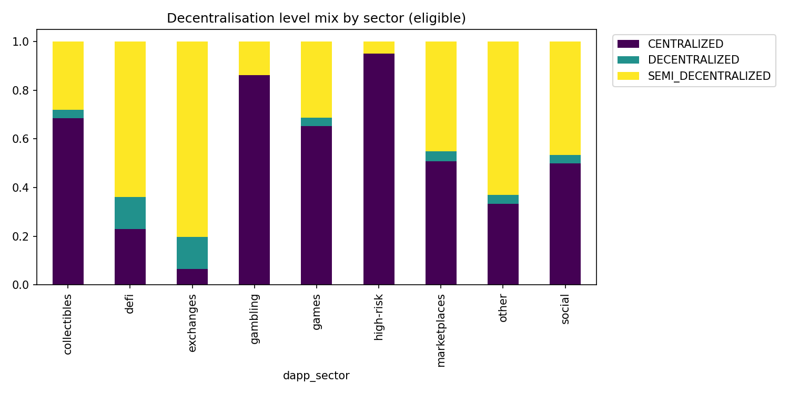
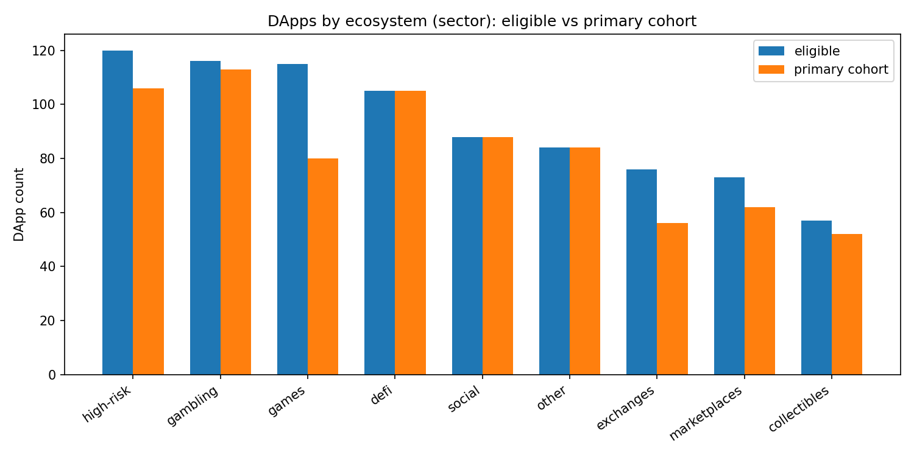
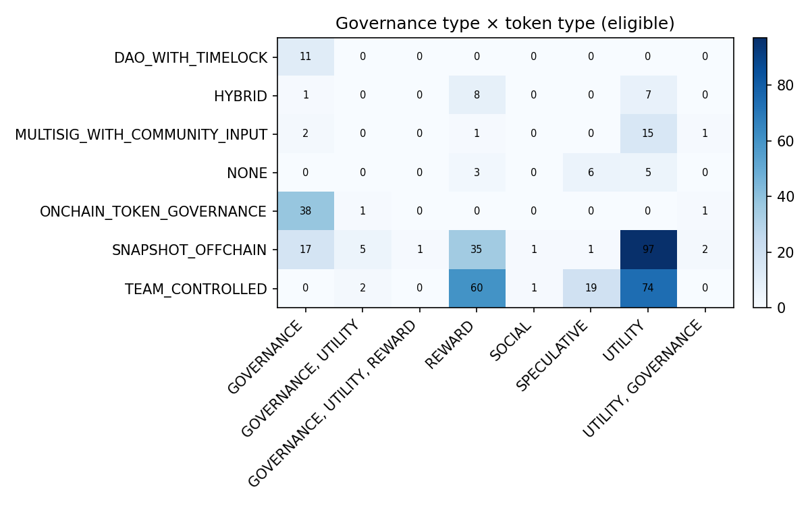
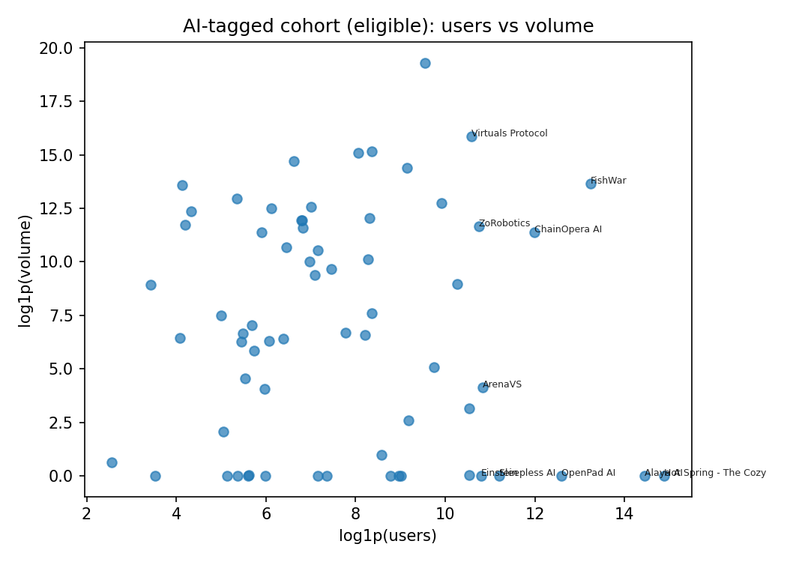
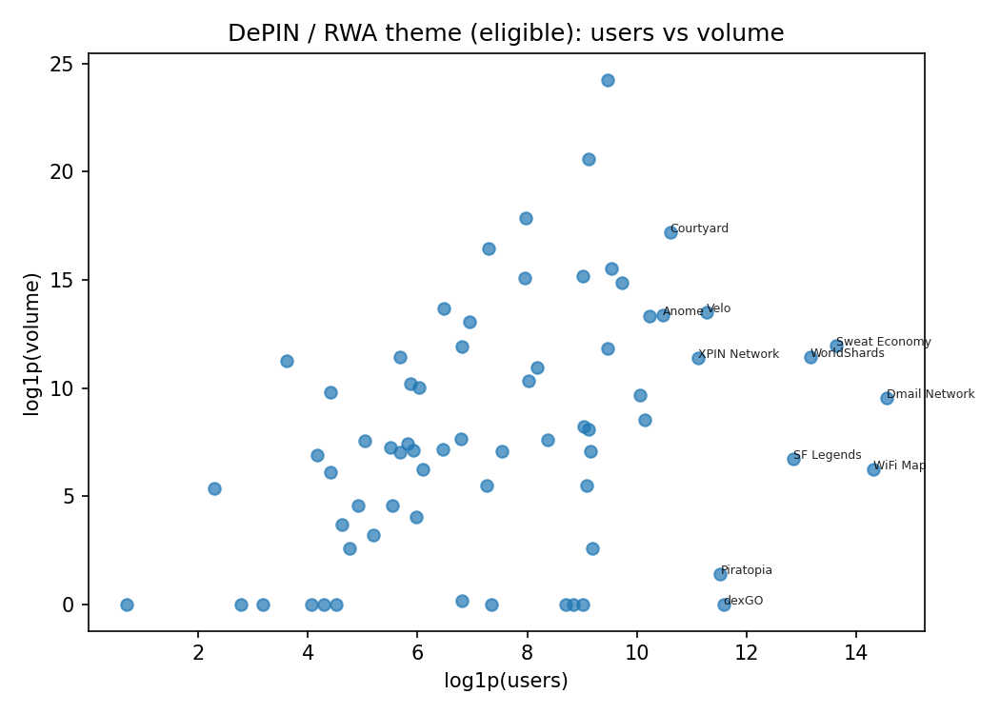
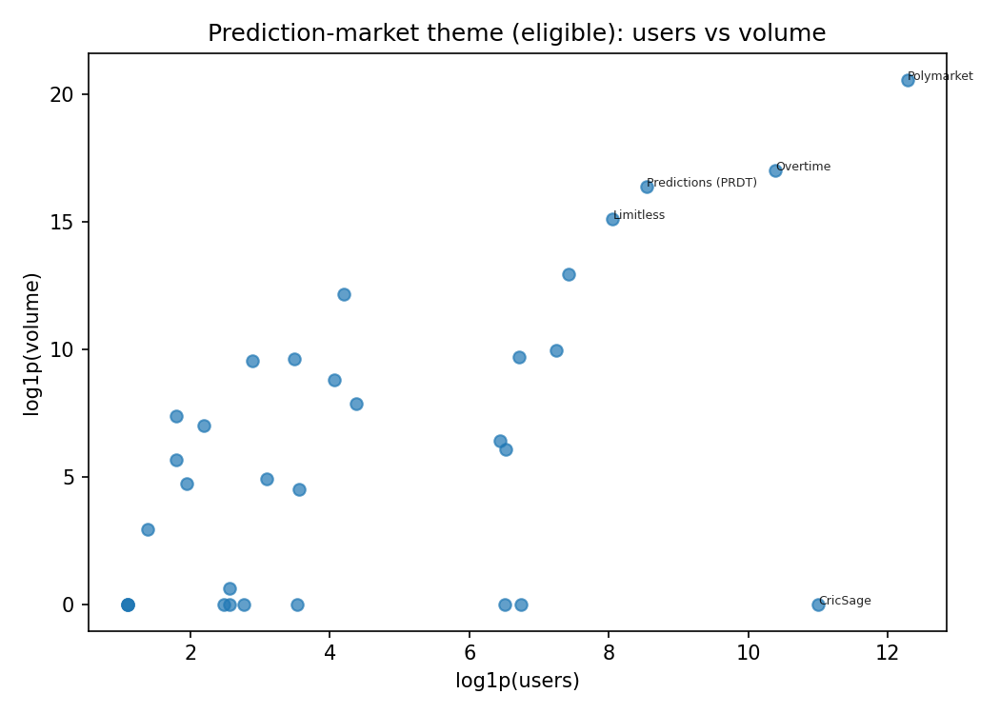

# Results and discussion

## Key messages (claim → evidence)

1. **Governance and token design vary systematically by sector** — Evidence: heatmaps `heatmap_gov_token_eligible.png` / cohort variant; crosstab CSVs in `outputs/`.
2. **Cohort selection concentrates signal without dropping governance completeness** — Evidence: `cohort_manifest.json` per-slice notes; sector bar chart `eco_sector_counts_eligible_vs_cohort.png`.
3. **Theme verticals (prediction, AI, DePIN/RWA) are thin but identifiable** — Evidence: `theme_cohort_summary.csv` and scatter plots `theme_*_users_volume.png`.
4. **Ratio-based outliers highlight business-model diversity** — Evidence: `dapp_anomalies.csv` (volume per user, tx per user, TVL/market cap) with sector-relative robust z-scores.

## Figures generated

*Decentralisation level distribution, stacked by sector*

*Sector DApp counts — eligible universe vs primary cohort*

*Governance type × token type heatmap — primary cohort*

*Governance type × token type heatmap — eligible universe*

*AI-native DApps — active users vs volume scatter*

*DePIN/RWA DApps — active users vs volume scatter*

*Prediction market DApps — active users vs volume scatter*

## Critical interpretation (thesis core)
- **Labelling assumption:** `dapp_sector` is the operational definition of “ecosystem”; DeFi-like products may appear under `exchanges` — conclusions about “DeFi” must reference the sector filter used.
- **Eligibility assumption:** requiring two non-zero activity fields removes silent rows but may retain very large yet thinly documented protocols; sensitivity analysis = compare eligible vs primary cohort charts.
- **Snapshot bias:** price and flow metrics reflect one export window; anomalies in returns (`percent_change_*`) are descriptive only.
- **Theme keywords:** AI and DePIN/RWA masks are inclusive by design; qualitative read of `research_comments` should validate any single-DApp claim.
- **Falsification ideas:** if cohort-expanded analysis (lower K) reverses governance–token associations, the pattern is selection-driven; if outliers disappear when excluding one chain, the driver is chain coverage not governance.
