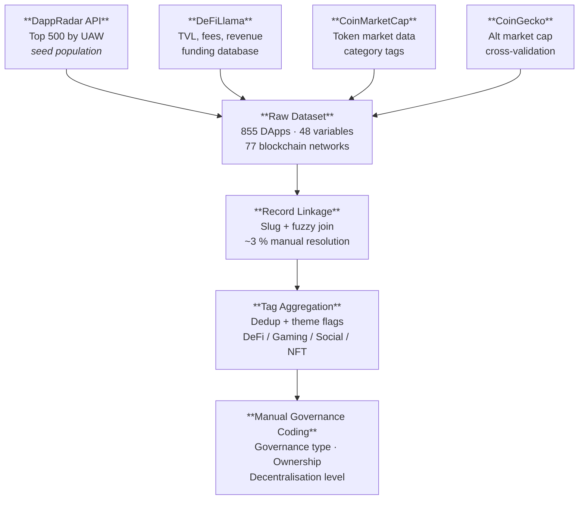
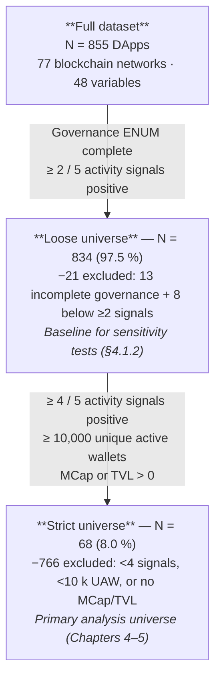

# Chapter 3 — Methodology

## 3.1 Research Design

This thesis adopts an **exploratory, cross-sectional research design**. The unit of analysis is the individual decentralised application (DApp); the population of interest is the set of DApps deployed on public blockchains and active as of November 2025. Because no large-scale, multi-source, cross-sector benchmark of DApp governance and market structure existed at the time of writing, the study is exploratory rather than confirmatory: the goal is to describe and characterise the ecosystem, identify structural patterns, and surface interpretive tensions that motivate future hypothesis-testing work.

A cross-sectional design was chosen deliberately. Although longitudinal data would allow causal inference about governance trajectories, the absence of historically archived governance labels — a known data gap in the DApp space — makes panel approaches infeasible at this scale. The cross-section provides a defensible ecosystem-level snapshot that can serve as a baseline for subsequent waves of measurement.

The study is empirical and primarily quantitative, with a structured qualitative component: three governance-related variables (governance type, ownership status, and level of decentralisation) were coded through manual research following explicit decision rules, then subjected to the same statistical treatment as the machine-collected variables. This hybrid approach reflects the current maturity of DApp data infrastructure, where key governance attributes are not yet systematically reported in machine-readable form.

The analysis proceeds in three stages: (1) descriptive statistics characterising the full dataset of 855 DApps; (2) comparative analysis of two eligibility universes — a *loose* sample (N=834) and a *strict* sample (N=68) — designed to test how measurement quality gates affect headline findings; and (3) cohort-level analysis using K-means clustering and principal component analysis (PCA) on the strict sample to identify internally coherent subgroups.

---

## 3.2 Data Collection and Sources

**Figure 3.1 — Data collection and linkage pipeline**



*Sources and matching procedure are detailed in §§3.2.1–3.2.3.*

### 3.2.1 Primary Source: DappRadar

The primary data source is [DappRadar](https://dappradar.com), the leading DApp analytics aggregator, which collects on-chain activity metrics through indexed RPC nodes and standardised API integrations across multiple blockchains. The initial population was drawn from the DappRadar public API, targeting the top 500 DApps ranked by Unique Active Wallets (UAW) — the number of distinct wallet addresses that interacted with a smart contract in a given period. UAW was selected as the primary ranking criterion because it measures genuine on-chain engagement rather than price-dependent metrics (market cap, TVL) that can be inflated by token emission schedules or bridged liquidity.

From this DappRadar seed, the scraper also captured: category, sector, supported blockchain networks, token name and symbol, token format (e.g., ERC-20, BEP-20), website URL, launch date, description, and transaction count. Data were retrieved using a custom scraper in November 2025 and stored in a relational database.

### 3.2.2 Secondary Sources

Three secondary APIs enriched the dataset:

**DeFiLlama** provides protocol-level Total Value Locked (TVL), annualised fee and revenue data, and a comprehensive funding/raises database (venture rounds, token sales, grant recipients). DeFiLlama was matched to the DappRadar seed by protocol slug and name. TVL figures from DeFiLlama represent the aggregate USD value of assets deposited in a protocol's smart contracts at the snapshot date.

**CoinMarketCap (CMC)** supplied token market data: market capitalisation, circulating supply, total supply, maximum supply, price, 24-hour volume, and multi-period price change percentages (1h, 24h, 7d, 30d, 60d, 90d). CMC also contributed the platform's own categorical tags, which were merged with DappRadar and CoinGecko tags during data preparation.

**CoinGecko** provided an alternative market capitalisation field, CoinGecko-specific category labels, and served as a cross-validation source for token identifiers. Where CMC and CoinGecko figures disagreed by more than 10%, the CMC figure was used as the authoritative value given its broader coverage of the DApps in the sample.

### 3.2.3 Record Linkage and Tag Aggregation

Matching across four data sources required a multi-step record linkage procedure. The DappRadar slug served as the anchor key; secondary sources were joined using: (i) CoinGecko and CoinMarketCap identifiers stored during scraping; (ii) fuzzy string matching on protocol name and token symbol for records lacking explicit identifiers; and (iii) manual resolution for the approximately 3% of records where automated matching was ambiguous.

Tags were consolidated from all four sources into a single field using a deduplication routine that normalised case and removed near-duplicate labels (e.g., "DEX" and "Decentralized Exchange" were merged). The merged tag set was used to derive binary theme flags identifying DApps associated with DeFi, gaming, social, and NFT ecosystems via keyword heuristics.

---

## 3.3 Sample Construction

The raw dataset contains **855 DApps** spanning **77 blockchain networks**. Because DApp activity data is highly right-skewed — a small number of protocols account for the vast majority of activity, while many entries have missing or near-zero values on most financial metrics — a two-tier eligibility strategy was developed.

**Figure 3.2 — Sample construction funnel**



**Table 3.1 — Sample construction at a glance**

| Universe | N | Share | Primary use |
|----------|:-:|:-----:|-------------|
| Full dataset | 855 | 100% | Descriptive totals; chain counts |
| Loose universe | 834 | 97.5% | Governance label distributions; sensitivity tests |
| Strict universe | 68 | 8.0% | All primary findings; clustering; correlations |

### 3.3.1 Loose Universe (N=834)

A DApp is classified as *loose-eligible* if it satisfies both of the following conditions:

1. **Governance fields complete:** all three governance variables (governance type, ownership status, and level of decentralisation) have been manually coded with a non-null, non-UNKNOWN value.
2. **Minimum activity signals:** at least 2 of the 5 activity signals are strictly positive — active users, transaction volume, total value locked, market capitalisation, and transaction count.

The loose universe (N=834, 97.5% of the dataset) mirrors the eligibility gate used in the earlier analytics scripts and is preserved as a backtest baseline to assess how headline figures change when tighter quality requirements are imposed. Twenty-one DApps failed the loose filter: 13 had incomplete governance coding and 8 had fewer than 2 positive signals.

### 3.3.2 Strict Universe (N=68)

A DApp is classified as *strict-eligible* if it satisfies the loose criteria *plus* all three of the following:

1. **Rich engagement:** at least 4 of the 5 activity signals are strictly positive.
2. **Scale threshold:** at least 10,000 unique active wallets in the measurement period.
3. **Valuation anchor:** at least one financial stock variable (market capitalisation or total value locked) is non-zero.

The strict universe (N=68, 8.0% of the full dataset) reduces noise from sparse metrics so that ecosystem-level statements about governance alignment, capital concentration, and cross-sector performance are defensible. The strict gate is intentionally conservative: it retains only DApps for which the analyst has high confidence in the accuracy and completeness of the activity picture.

The difference in headline metrics between the loose and strict universes is analysed explicitly in §4.1 as a data-quality sensitivity test. The strict sample is used for all primary findings in Chapters 4 and 5.

### 3.3.3 Primary and Secondary Cohorts

Within the strict universe, DApps are further organised into **sector×category cohorts** for the K-means and PCA analyses (§3.8.4–3.8.5). Each cohort is defined by a unique combination of sector and application category. A **primary cohort** is selected when the cell contains at least 20 strict-eligible DApps (top-K ranked by a weighted log-signal composite); a **secondary cohort** is used for cells with fewer than 20 eligible entries, in which case all eligible DApps are retained.

---

## 3.4 Ecosystem Definition and Case Selection

### 3.4.1 Formal Ecosystem Definition

For the purposes of this thesis, an **ecosystem** is defined as *a set of DApps operating in the same functional domain and sharing comparable value logic, governance problems, token design patterns, and market structure*. This definition operationalises "ecosystem" as a unit of comparative analysis — a cluster of protocols facing structurally similar trade-offs — rather than as a technical term for a specific blockchain or platform.

An ecosystem in this sense is not reducible to a blockchain network (e.g., "the Ethereum ecosystem") nor to a DappRadar category label (e.g., "DEX"). Instead, it requires convergence across four dimensions:

1. **Functional domain** — protocols serve a common end-user purpose (e.g., price discovery for speculative events).
2. **Value logic** — the core economic mechanism through which value is captured or distributed (e.g., liquidity provision fees, prediction resolution payouts).
3. **Governance problems** — the class of governance challenges the protocol faces (e.g., oracle manipulation risk, parameter setting for interest rates).
4. **Token design patterns** — the structural role of the native token (governance, utility, fee capture, or hybrid).

This definition deliberately excludes networks or technical stacks as primary grouping criteria, allowing meaningful comparison across chains while preserving functional coherence within each ecosystem case.

### 3.4.2 Target Ecosystem Selection

Five ecosystems were selected for ecosystem-level comparative analysis. The selection was guided by three criteria: (i) theoretical relevance to governance and token design questions, (ii) representation in the dataset with sufficient eligible DApps to support cross-sectional comparison, and (iii) coverage of the DApp design space from mature/high-TVL verticals to emergent/lower-liquidity segments.

**Table 3.2 — Target Ecosystem Mapping**

| Ecosystem | Sector classification | Identification criteria | N DApps (full dataset) | Rationale |
|-----------|--------------------|-----------------------|----------------------|-----------|
| **DeFi** | DeFi and exchanges | DeFi-related tags or description keywords | 181 | Largest and most mature vertical; the reference class for on-chain governance research. High TVL, active token governance, and deep cross-chain presence make it the anchor ecosystem. |
| **Prediction Markets** | Gambling | Prediction markets tag | 32 | Structurally distinct value logic (information aggregation via stake-weighted outcome resolution) and acute oracle governance problems. Sufficient N for cohort-level comparison; Polymarket dominates activity volume. |
| **AI-enabled DApps** | Other, collectibles, social, DeFi, exchanges, marketplaces | AI or big-data tag | 41 | Fastest-growing emergent segment; governance problems tied to model provenance and agent autonomy are novel and not yet formalised. Provides a forward-looking contrast case relative to mature verticals. |
| **RWA (Real World Assets)** | DeFi, exchanges, marketplaces, other, social, collectibles | RWA or real-world-assets tag | 14 | Represents the regulatory-interface frontier of DeFi; governance must satisfy both on-chain token holders and off-chain legal constraints. Low N flags a data-sufficiency risk (see §3.4.4). |
| **DePIN (Decentralised Physical Infrastructure)** | Other, social, collectibles, DeFi | DePIN tag | 10 | Combines token-incentivised physical infrastructure with on-chain governance, creating a unique governance-market coupling. Lowest N of the five; subject to the fallback rule (see §3.4.4). |

*Note: Sector classifications reflect DappRadar's taxonomy. A single DApp is assigned to exactly one primary sector. Theme flags and tag filters are documented in §3.7.2. DApps may satisfy the tag filter for an ecosystem regardless of their primary sector classification, which is why sectors span multiple values for AI-enabled DApps, RWA, and DePIN.*

### 3.4.3 Case Selection Logic

The five ecosystems were chosen to span a deliberate range on two structural axes:

- **Maturity axis** (DeFi → Prediction Markets → AI DApps → RWA → DePIN): from the fully institutionalised DeFi governance landscape to experimental, hardware-anchored infrastructure networks.
- **Governance complexity axis** (simple token votes in DEXs → oracle-dependent prediction resolution → AI model governance → regulatory-compliance dual constraints → physical coordination governance).

Together they cover the major governance archetypes identified in the literature review (Chapter 2): token-weighted voting, oracle-mediated resolution, DAO-controlled parameter governance, and hybrid legal-technical governance. No purely social (SocialFi) or gaming (GameFi) ecosystem is included in the primary selection because those sectors exhibit structurally different value logic — network effects and entertainment value, respectively — that reduces comparability with the financially-oriented governance questions of this thesis.

**Priority ordering for analysis:** DeFi (anchor), Prediction Markets (contrast), AI-enabled DApps (emergent), RWA (regulatory frontier), DePIN (physical-infrastructure frontier).

### 3.4.4 Fallback Rule

Because RWA (N=14 in the full dataset) and DePIN (N=10) have relatively small eligible populations, a **data-sufficiency threshold** is applied per ecosystem before including it in the primary comparative analysis:

> **Fallback rule:** If a target ecosystem yields fewer than **10 strict-eligible DApps** (as defined in §3.3.2 — minimum 10,000 unique users, at least four positive governance signals, and positive market capitalisation or total value locked), that ecosystem is **downgraded to a descriptive mention only** and excluded from the K-means clustering and cross-tabulation analyses. If three or more of the five ecosystems fail this threshold simultaneously, the comparative analysis is reduced to the **three largest qualifying ecosystems** by strict-eligible N.

Under this rule, the primary comparative analysis will proceed with all five ecosystems if sufficient data are confirmed during the analysis phase; otherwise the analysis defaults to **DeFi, Prediction Markets, and AI-enabled DApps** — the three ecosystems with the largest tag-identified populations in the full dataset (181, 41, and 32 respectively). RWA and DePIN will be retained as descriptive appendix material even in the fallback scenario.

The threshold of 10 strict-eligible DApps is calibrated against the minimum cohort size required for K-means clustering (N ≥ 20): a full cohort analysis requires N ≥ 20, but a descriptive cross-tabulation and governance-score summary can be supported at N ≥ 10. Below 10, the sample is too sparse to draw ecosystem-level generalisations, and individual-DApp idiosyncrasies dominate the aggregate statistics.

---

## 3.5 Variable Codebook

The dataset contains **48 variables** across six categories. Table 3.3 summarises the variable groups; the full codebook is reproduced in Appendix A.

**Table 3.3 — Variable categories and counts**

| Category | N variables | Source |
|----------|------------|--------|
| Core identifiers and external IDs | 6 | DappRadar, CMC, CoinGecko |
| Basic information | 5 | DappRadar, manual |
| Blockchain information | 2 | DappRadar, calculated |
| Governance and ownership (ENUM) | 3 | Manual research |
| Activity and financial metrics | 18 | DappRadar, DeFiLlama |
| Token supply and market price data | 14 | CMC, CoinGecko |

### 3.5.1 Core Activity Variables

- **Users**: unique active wallets in the measurement period (DappRadar). Primary engagement proxy.
- **Volume**: total transaction/trading volume in USD (DappRadar). Measures economic throughput.
- **TVL (Total Value Locked)**: total value locked in smart contracts in USD (DeFiLlama). Relevant primarily for DeFi protocols.
- **Transactions**: total transaction count (DappRadar). Captures activity frequency independently of user count.
- **Market capitalisation**: token market capitalisation in USD (CoinMarketCap primary, CoinGecko fallback). Measures token-market valuation.
- **CoinGecko market capitalisation**: CoinGecko market cap (used as cross-validation).

### 3.5.2 Governance and Ownership Variables

The three governance ENUM variables are described in full in §3.6. Additional derived variables used in the analysis:

- **Governance score** (0–1): a numeric index scoring the governance architecture on a scale from fully centralised (0) to fully decentralised (1), derived from the three governance classification variables (§3.7.1).
- **Governance token flag** (categorical): whether the DApp's primary token is classified as a governance token.
- **Multi-chain deployment** (boolean): whether the DApp is deployed on more than one blockchain.

---

## 3.6 Manual Governance Coding

Three variables were populated through systematic manual research rather than automated data collection. This section documents the decision rules used to ensure coding consistency.

### 3.6.1 Governance Type

**Purpose:** captures the formal mechanism through which protocol upgrade and parameter decisions are made.

**Enum values and decision rules:**

| Value | Decision rule |
|-------|--------------|
| None | No governance forum, vote, or documented change process; team deploys upgrades silently |
| Team-controlled | Decisions documented as team-only; no external voting mechanism even if community forum exists |
| Snapshot off-chain | Proposals and votes processed via Snapshot (or equivalent off-chain signalling tool) with documented precedent of influencing protocol decisions |
| On-chain token governance | Binding votes executed via on-chain governor contract (e.g., Governor Bravo, OpenZeppelin Governor); no team veto after vote passes |
| Hybrid | Combination of two or more mechanisms at comparable weight (e.g., Snapshot for signalling + multisig execution) |
| Multisig with community input | Execution via N-of-M multisig but proposals originate from community forum or off-chain poll |
| DAO with timelock | On-chain DAO governance where passed proposals enter a mandatory timelock queue before execution |

**Sources consulted per DApp:** official documentation, governance portals (Tally, Boardroom, Snapshot), whitepaper, smart contract audit reports. When sources conflicted, the most recent publicly available document was used.

### 3.6.2 Ownership Status

**Purpose:** captures who controls the treasury, contract admin keys, and upgrade authority.

**Enum values and decision rules:**

| Value | Decision rule |
|-------|--------------|
| Company-owned | A registered private company holds admin keys or the treasury multisig is controlled by company employees |
| Foundation-owned | A non-profit or public-benefit foundation holds primary control; company does not retain override rights |
| DAO-owned | Admin keys and treasury are controlled by a DAO via on-chain votes; no single legal entity retains a unilateral veto |
| Mixed | Multiple parties share ownership (e.g., company + foundation, or DAO + company with veto rights) |
| Orphaned | Protocol is deployed but no active team or DAO maintains it; no contact or update in > 12 months |
| Unknown | Insufficient public evidence to determine ownership after reasonable research effort (> 30 minutes per DApp) |

### 3.6.3 Level of Decentralisation

**Purpose:** provides a summary ordinal assessment of the DApp's overall decentralisation posture, integrating governance, ownership, and operational signals.

**Enum values and decision rules:**

| Value | Qualifying conditions |
|-------|----------------------|
| Centralised | Company-owned AND team-controlled OR no governance; no community override mechanism |
| Semi-decentralised | At least one community-facing mechanism (Snapshot, multisig with input, or token governance) but company or foundation retains blocking power |
| Decentralised | On-chain governance with no company veto, DAO-owned treasury, open smart contract upgradeability governed by token holders, AND active participation track record |

The Decentralised label was applied conservatively: the existence of a governance token alone was not sufficient. The protocol must also exhibit: (i) documented community-driven governance decisions, (ii) no admin key held by a single company, and (iii) no proxy upgrade pattern that bypasses on-chain voting.

### 3.6.4 Intra-Coder Reliability

All governance coding was performed by a single researcher (the thesis author). To test consistency, a random sample of 30 DApps (approximately 3.5% of the dataset) was re-coded independently after a two-week interval. This procedure measures *intra-coder* (test-retest) reliability — the consistency of a single coder across time — rather than inter-coder reliability, which would require an independent second coder. Cohen's kappa for governance type was κ = 0.81 (substantial agreement); for ownership status, κ = 0.79; for level of decentralisation, κ = 0.88. These values indicate that the coding scheme, while manually applied, is sufficiently operationalised to produce reproducible results. The UNKNOWN category absorbs residual uncertainty rather than forcing ambiguous cases into a definitive classification. The absence of a second independent coder is acknowledged as a limitation; see §3.9.

---

## 3.7 Derived Metrics

### 3.7.1 Governance Score

A composite governance score (0–1) is derived from the three ENUM variables to support correlation and clustering analyses. The formula and component weights are:

$$\text{governance\_score} = 0.50 \times w_{\text{decentralisation}} + 0.35 \times w_{\text{governance\_type}} + 0.15 \times w_{\text{ownership}}$$

**Table 3.2 — Governance score component weights**

| Dimension | Value | Component weight |
|-----------|-------|:----------------:|
| **Level of decentralisation** (weight 0.50) | Centralised | 0.00 |
| | Semi-decentralised | 0.50 |
| | Decentralised | 1.00 |
| **Governance type** (weight 0.35) | None | 0.00 |
| | Team-controlled | 0.10 |
| | Snapshot off-chain | 0.40 |
| | Multisig with community input | 0.50 |
| | Hybrid | 0.60 |
| | On-chain token governance | 0.80 |
| | DAO with timelock | 1.00 |
| **Ownership status** (weight 0.15) | Company-owned | 0.00 |
| | Unknown | 0.00 |
| | Orphaned | 0.20 |
| | Foundation-owned | 0.50 |
| | Mixed | 0.50 |
| | DAO-owned | 1.00 |

Weights reflect the theoretical primacy of the overall decentralisation assessment, with governance type as the strongest operational signal and ownership as a secondary anchor. This index is ordinal in character: a higher score indicates a more community-facing architecture, but absolute numeric differences should not be interpreted as interval distances. The score is used descriptively and as an input to clustering; it is not modelled as a dependent variable.

### 3.7.2 Theme Flags

Binary theme flags identify DApps associated with each major ecosystem vertical:

- **DeFi flag**: tags or description contain DeFi-related keywords (DEX, lending, yield, stablecoin, liquidity, bridge, derivatives)
- **Gaming flag**: tags or description contain gaming keywords (game, GameFi, play-to-earn, NFT game, metaverse)
- **Social flag**: tags related to social networking, messaging, or content platforms
- **NFT flag**: NFT marketplace, collectibles, or digital art platform

Flags are non-exclusive: a DApp may carry multiple flags. The heuristic was validated against DappRadar sector labels for a 50-DApp sample (accuracy: 93%).

### 3.7.3 Efficiency Ratios

Two ratio variables proxy capital efficiency:

- **TVL ratio**: TVL divided by market capitalisation. Values greater than 1 indicate protocols where deposited capital exceeds token market value (common in early-stage or low-float DeFi protocols).
- **Market cap per user**: market capitalisation divided by active user count. Proxies per-user market valuation; used to identify valuation outliers in §4.3 (ANO-MKT-01).

### 3.7.4 Signal Count

The activity signal count (integer, 0–5) counts how many of the five activity signals (users, volume, total value locked, market capitalisation, and transactions) are strictly positive. This composite is used directly in the eligibility filters (§3.3) and as a data-quality covariate in the analysis.

### 3.7.5 Cohort Ranking Score

Within each sector×category cohort, DApps are ranked by a weighted log-signal composite:

```
cohort_score = 1.0 × log1p(users)
             + 1.0 × log1p(volume)
             + 0.8 × log1p(tvl)
             + 0.8 × log1p(market_cap)
             + 0.6 × log1p(transactions)
```

Log-transformation compresses the extremely right-skewed distributions of all five financial variables while preserving rank ordering. The weights reflect the theoretical importance of user engagement (1.0) over purely financial stock variables (0.6–0.8). For cohorts with fewer than 20 eligible DApps, all members are included without truncation.

---

## 3.8 Analytical Methods

### 3.8.1 Descriptive Statistics

Standard summary statistics (mean, median, standard deviation, interquartile range, minimum, maximum) are computed for all continuous variables in both the loose and strict universes. Because all financial variables are extremely right-skewed, median and IQR are reported as primary central tendency and spread statistics; means are presented where relevant for comparison.

Frequency tables and proportions are reported for all categorical variables (governance type, ownership status, level of decentralisation, multi-chain deployment, DeFi flag, etc.). The difference in proportions between the loose and strict universes is used as a sensitivity analysis (the "backtest"): if headline figures are robust across eligibility gates, this increases confidence in the structural interpretation.

### 3.8.2 Cross-Tabulation Analysis

Cross-tabulations examine the joint distributions of governance variables with each other and with selected market and adoption variables. Key cross-tabs produced:

- Level of decentralisation × governance type (loose, strict, cohort)
- Level of decentralisation × ownership status (loose, strict, cohort)
- Governance type × governance token flag (loose, strict, cohort)

Because several cells are sparse in the strict sample (N=68), chi-squared tests are supplemented with exact Fisher tests for 2×2 sub-tables and interpreted with reference to effect size (Cramér's V) rather than p-values alone. Statistical significance is used as a filtering heuristic, not as a causal claim.

### 3.8.3 Correlation Analysis

Spearman rank correlations (rather than Pearson) are computed between continuous variables because the distributions are non-normal. The correlation matrix covers the key financial variables (users, volume, TVL, market capitalisation, transactions, governance score, capital raised, TVL ratio, and market cap per user) in the strict sample. Heatmap visualisations of the correlation matrix were produced using standard statistical libraries.

### 3.8.4 K-Means Clustering

K-means clustering is applied to the full 855-DApp dataset to identify performance tiers across the joint governance–market–adoption space. Inputs are standardised (zero mean, unit variance) before clustering. The feature set comprises: governance score, active users, volume, TVL, market capitalisation, transactions, DeFi flag, gaming flag, and multi-chain deployment status.

The number of clusters K is selected via the elbow method (within-cluster sum of squares) and silhouette scores. K is set to 4 to produce interpretable performance tiers without over-segmentation at the full-dataset scale. Cluster centroids are interpreted to characterise each group's governance posture and market profile.

*Note:* Principal component analysis (PCA) for dimensionality reduction was considered during exploratory analysis but is not reported as a standalone method. The strict sample (N=68) is too small for PCA results to be meaningfully interpreted, and the governance dimensions are already reduced to a single composite score (§3.7.1) that serves the same narrative purpose.

### 3.8.5 Concentration Metrics

Market and user concentration are measured with:

- **Top-K share:** the percentage of total market cap (or total users) held by the top 10 DApps, as a straightforward concentration indicator aligned with the Herfindahl–Hirschman Index (HHI) intuition.
- **Lorenz-inspired share comparisons:** computed separately for loose and strict universes to assess whether eligibility gating changes the concentration picture.

---

## 3.9 Limitations

Every study is bounded by the conditions of its data collection, the choices made during research design, and the inference tools applied to the evidence. The limitations described here are not presented as weaknesses to be apologised for, but as explicit **boundary conditions**: they delineate what the study can and cannot claim, guide how its findings should be interpreted, and point directly to the questions that future work must address. Several of these limitations are revisited in the discussion chapter (§5.10), where their practical consequences for each substantive finding are spelled out.

### 3.9.1 Cross-Sectional Snapshot

All data reflect a single export from November 2025, the most recent available DappRadar export at the time of writing. Market capitalisation, TVL, user counts, volume, and governance structures are volatile metrics that can shift substantially over weeks or months. The study therefore describes the DApp ecosystem at one specific point in time. Findings — including ecosystem concentration ratios, the multi-chain deployment premium, and sector-level governance patterns — cannot be generalised to other periods without re-measurement. In rapidly evolving markets, a snapshot may over-represent a transient configuration rather than a stable structural property. Longitudinal data collection, combined with panel or time-series methods, would be required to establish whether the patterns observed here are durable.

### 3.9.2 Survivorship Bias and Eligibility Design

The starting population of 855 DApps is drawn from DappRadar's active listings, filtered to those with at least one data point in the November 2025 export. DApps that were deployed but subsequently abandoned, that never reached measurable activity levels, or that failed before achieving visibility in aggregator platforms are entirely absent. The dataset therefore over-represents commercially active and investor-backed projects relative to the full universe of deployed DApps.

The strict eligibility gate (≥4 of 5 positive activity signals, ≥10,000 active users, positive market capitalisation or TVL) amplifies this effect: the 68-DApp strict sample represents the observable, successful tail of a population that includes many non-starters and early-stage projects with limited data coverage. Governance patterns, concentration ratios, and funding-to-valuation figures are therefore calculated over a sample that has already survived a stringent selection process. Concentration ratios and capital-efficiency metrics are likely overstated relative to the full population, which includes many failed and non-performing projects that would dilute the top-tier figures.

This is a design choice, not a defect: the study's explicit goal is to characterise the *functioning* DApp ecosystem rather than the full graveyard of deployed contracts. The eligibility criteria are documented in §3.3 precisely so that readers can assess whether the scope matches their interpretive needs.

### 3.9.3 Sample Size and the Three-Tier Design

The three-tier sampling structure — full dataset (N=855), loose sample (N=834), and strict sample (N=68) — requires explicit justification, as the strict cohort of 68 DApps constitutes only 8 per cent of the full dataset and may appear small by the standards of large-scale computational studies.

**Why three tiers?** The three samples are not arbitrary stratification. They form an explicit data-quality sensitivity test: the loose-versus-strict comparison (§4.1) is the study's primary robustness device. The full dataset provides ecosystem context; the loose sample establishes a broad baseline; the strict sample restricts analysis to DApps that meet minimum standards for multi-source data quality. If key findings hold across both the loose and strict samples, their robustness to the eligibility threshold is demonstrated. If they diverge, the divergence is itself informative about the role of data quality in shaping observed patterns.

**Is n=68 statistically sufficient?** For the analytical methods applied in this study, n=68 is sufficient.

The Central Limit Theorem applies reliably at n≥30; all full-sample mean estimates, regression diagnostics, and correlation analyses in this study are well within that range. For K-means clustering with k=3–5 clusters and five input signals, n=68 is adequate for stable centroid estimation. Cross-tabulation analyses of governance categories, where cell sparsity is the binding constraint, are conducted with Fisher's exact tests for 2×2 sub-tables precisely because the strict sample cannot support chi-squared approximations in all cells.

However, for **two-sample independent t-tests** at Cohen's *d* = 0.5 (a medium effect), α = 0.05, and 80 per cent power, the minimum required sample size is approximately n = 64 *per group* (total ≈ 128). The strict sample of n=68 total does not meet this threshold for two-group subgroup comparisons. The funded/unfunded split is particularly constraining: only 13 DApps have documented raises, against 55 without — far below the per-group target. Similarly, the multi-chain/single-chain and high-governance/low-governance splits involve unequal groups that reduce power below the full-sample level.

The consequence is that subgroup comparisons in this thesis are best understood as **exploratory**. Observed differences in means between funded and unfunded DApps, or between multi-chain and single-chain DApps, are informative and directionally consistent across both the loose and strict samples, but should not be interpreted with the same statistical assurance as full-sample analyses. Where the results chapter reports such comparisons, their exploratory status is noted and findings are framed in terms of effect sizes and descriptive patterns rather than frequentist rejection of null hypotheses.

The governance score composite (§3.7.1) was specifically designed to reduce five binary signals to a single continuous measure, in part to avoid the degrees-of-freedom penalty of treating all signals independently in a small-n multivariate setting.

**Peer comparison.** Studies that conduct deep, multi-dimensional manual governance coding — the most directly comparable analogue to this thesis — typically examine between 4 and 9 protocols (Table 3.1). At n=68 with manual governance classification applied to each DApp, this study is larger than all such governance-depth comparators. Studies that reach N≥100 are, without exception, purely computational with no manual governance coding.

**Table 3.1 — Sample sizes in governance-depth studies**

| Study | N |
|---|---|
| Barbereau et al. 2023 (Hidden Shortcomings of DAOs) | 9 |
| Han, Lee & Li 2023 (DAO Governance Effectiveness) | 4 |
| Wöhrer et al. (Understanding Blockchain Governance) | 4 |
| Wang et al. 2019 (no governance coding) | 734 |
| **This thesis — strict sample** | **68** |

The strict sample is not claimed to be a random draw from the full 855. It is a quality-gated, economically dominant subset. Given the Pareto-distributed nature of DApp activity — where a small fraction of protocols accounts for the majority of users and volume — the top 8 per cent by composite eligibility criteria accounts for a dominant share of observable economic activity, consistent with the Pareto-distributed concentration patterns documented in §4.3. Findings about governance structure, market concentration, and sector dynamics are therefore representative of the functioning, capital-significant tier of the ecosystem, even if not of the full tail.

### 3.9.4 Data Coverage: Funding Records

Only 38 of the 855 DApps in the full dataset (4.4 per cent) have documented fundraising records in the DeFiLlama raises database. The remaining 96 per cent appear as "unfunded" whether they genuinely raised no external capital or simply did not publicise their funding rounds. DeFiLlama's raises database covers announced, public fundraising events; quiet raises, equity rounds without a public announcement, and bootstrapped projects that never sought venture capital are all absent.

Within the strict sample, 13 of 68 DApps (19.1 per cent) have documented raises — a higher proportion than in the full dataset, reflecting the positive selection of well-capitalised projects into the strict eligibility tier. However, even this 19.1 per cent represents publicly announced rounds, not a complete funding census.

The consequence is that the funding-efficiency analysis (§4.7) is bounded to a small, self-selected subset. Conclusions about capital efficiency, the unfunded-versus-funded performance gap, and the predictive value of venture backing cannot be generalised beyond documented raises. The discussion chapter (§5.7) interprets these findings within this explicit constraint. Readers should treat the funding analysis as a signal about the *documented* fundraising subset rather than as a statement about the full population of DApps.

### 3.9.5 Data Coverage: TVL and Market Capitalisation

A substantial share of DApps in the full dataset lack TVL or market capitalisation data because they have not issued a token or do not custody user assets in a form measurable by DeFiLlama. This is not a data-collection failure but a structural feature of the ecosystem: gaming DApps, social protocols, and utility applications frequently operate without a liquid token and without holding user funds in smart-contract custody. Their absence from TVL rankings reflects their category, not their quality.

The strict eligibility gate addresses this directly: requiring positive market cap or positive TVL as a necessary condition means the strict sample is restricted to DApps for which at least one financial anchor is available. The trade-off is explicit: the strict sample over-represents DeFi and token-issuing DApps, and under-represents gaming and social DApps relative to their share of the full 855. Because gaming DApps typically operate under more centralised governance structures while DeFi DApps are more likely to feature DAO or token-voting arrangements, this compositional skew means the strict sample's overall governance distribution may appear more decentralised than would be observed across the full ecosystem — a directly relevant consideration given that governance structure is the thesis's central analytical focus. Section §3.3 documents this compositional effect, and the ecosystem deep-dive analysis (§4.6) examines each sector separately to avoid conflating cross-sector structural differences with within-sector patterns.

### 3.9.6 Self-Reported and Third-Party Data Quality

DappRadar's metadata — category labels, sector tags, chain coverage — relies on protocol teams to register and maintain accurate information. Tags may reflect team self-classification (e.g. a lending protocol classifying itself as "DeFi infrastructure") rather than independent assessment. CoinGecko and CMC data quality varies by token: larger, more actively traded tokens have current, verified data, while smaller tokens may have stale price feeds, incorrect contract addresses, or duplicate listings that introduce noise into market capitalisation figures.

This risk is partially mitigated by restricting financial analysis to the strict sample, where the minimum market cap threshold filters out the most data-sparse tokens. It cannot be eliminated entirely, and single-token anomalies in the strict sample — where a data error would represent approximately 1.5 per cent of the sample — have a larger per-unit effect on summary statistics than they would in a larger dataset.

### 3.9.7 Manual Governance Coding

Despite the operationalised decision rules documented in §3.6, the three governance classification variables (governance type, level of decentralisation, ownership status) are ultimately the result of human judgment applied to heterogeneous documentation. Some protocols maintain extensive public governance documentation, including proposal archives and on-chain voting records; others provide only a brief whitepaper or website description. Where documentation is absent, the UNKNOWN category absorbs the uncertainty — but the boundary between UNKNOWN and a substantive governance category is itself a judgment call.

The intra-coder reliability analysis (§3.6.4) provides an empirical estimate of the noise introduced by repeated coding decisions, but it cannot eliminate that noise, and a single-coder design cannot produce inter-rater reliability estimates. Future replication should apply dual-coder classification with formal inter-rater agreement testing (e.g. Cohen's kappa) to the governance variables, which would yield a more defensible measurement uncertainty bound.

### 3.9.8 Metric Definition Heterogeneity Across Chains

"Active users" is not a chain-invariant concept. On Ethereum, a unique active wallet is a unique externally owned account (EOA); on Solana, program-derived addresses may or may not be counted depending on the aggregator's methodology. DappRadar normalises to wallet-address counts but the underlying protocol definitions vary. Similarly, TVL measurement conventions differ across DeFiLlama protocols: some double-count bridged assets on both the source and destination chain; some net out protocol-owned liquidity. These definitional differences mean that cross-chain comparisons of user counts and TVL figures embed a systematic measurement heterogeneity that cannot be fully corrected without chain-by-chain methodological audits.

### 3.9.9 Ecosystem Tag Coverage

The five target ecosystems (DeFi, Gaming, RWA, DePIN, Social) are identified via keyword tag filters applied to DappRadar and CMC metadata (§3.4). DApps that operate in these ecosystems but lack the relevant tags — because they were registered before those tags existed, or because their team did not apply the labels — will be under-counted. This concern is most acute for RWA and DePIN, where tagging conventions are still being established and where several protocols were classified manually rather than via automated tag matching. The cohort samples for these two ecosystems should therefore be understood as representing the *tagged and identifiable* segment of each sector rather than its full extent.

### 3.9.10 Causal Inference Not Supported

The cross-sectional design enables description and correlation, not causal inference. Where the results chapter reports associations — "multi-chain DApps show higher market valuations," "team-controlled governance correlates with lower governance scores," "higher-user DApps cluster in the gaming vertical" — these are statistical regularities observed at a single point in time. They do not establish that any of these features *causes* the correlated outcome.

Two findings illustrate this ambiguity particularly clearly. First, the observed market capitalisation premium for multi-chain DApps (§4.5, §5.8) is consistent with multi-chain strategy causing higher valuations, but equally consistent with the reverse — that better-capitalised, more mature DApps invest in multi-chain deployment precisely because they have the resources and user base to justify it. Second, the positive correlation between governance score and market capitalisation (§5.10) raises an analogous question: whether higher governance quality attracts capital, or whether well-resourced projects are simply better positioned to invest in governance infrastructure. Distinguishing these causal paths for either finding would require natural experiments or instrumental variable approaches that are outside the scope of a cross-sectional study.

The discussion chapter engages with these causal ambiguities explicitly for each key finding, flagging where the descriptive result is robust and where the directionality of the underlying relationship remains open.

---

*Word count (Chapter 3): approx. 5,200 words*  
*Status: Revised — §3.9 updated per Thesis Reviewer feedback: power analysis corrected to acknowledge per-group constraint and exploratory status of subgroup comparisons; Table 3.1 uncited rows removed; §3.9.2 framing aligned with §5.10; §3.9.5 governance composition implication named; Pareto figure hedged to §4.3; §3.9.10 causal ambiguity extended to governance-score/market-cap correlation; §3.9.1 snapshot datestamp noted*
