# Chapter 4 — Results

## 4.1 Descriptive Statistics of the Full Dataset

The full dataset comprises 855 decentralised applications (DApps) deployed across 77 distinct blockchain networks, collected in November 2025. Together, these applications report 90.9 million total active users, a combined token market capitalisation of approximately $14.9 billion, and Total Value Locked (TVL) of $115.7 billion. The dataset captures 48 variables per DApp (see Appendix A — *forward reference: variable codebook*), of which 33 contain at least partial coverage across the full sample; the remaining variables are financial or governance fields for which sparse or no data were available for a significant share of the population.

### 4.1.1 Dataset Coverage and Completeness

Coverage varies substantially by variable category. Token market data — market capitalisation, price, volume, and supply fields sourced from CoinMarketCap and CoinGecko — are available for the 50.2 per cent of DApps that operate a native token. The remaining 49.8 per cent either have no token or lacked a match in the token-data APIs at the time of collection. TVL, sourced from DeFiLlama, covers protocol-level locked value and is non-zero for approximately 38 per cent of the dataset; this figure reflects the subset of DApps with measurable on-chain liquidity pools rather than all DApps in the sample. Activity metrics — users, transactions, and volume — sourced from DappRadar are present for the full 855-DApp population but exhibit extreme right skew: the mean user count is pulled far above the median by a small number of very large protocols.

Governance fields (governance type, ownership status, and level of decentralisation) were coded manually for all 855 entries following the decision rules described in §3.6 (*forward reference: governance coding rules*). Of these, 834 records received complete, non-UNKNOWN coding — the remaining 21 entries had insufficient publicly available information to assign definitive labels and were excluded from all subsequent analyses.

### 4.1.2 Loose versus Strict Universe Comparison

Table 4.1 presents the headline metrics comparison between the full loose universe (N=834) and the strict high-signal sample (N=68). The transition from loose to strict eligibility does not simply retain the "top" DApps in a linear sense; rather, it selects the subset for which the analyst has high confidence in the accuracy and completeness of *all* major metric categories simultaneously. The result is a meaningful shift in several headline indicators.

**Table 4.1 — Headline metrics comparison: loose universe versus strict high-signal sample**

| Metric | Loose universe (N=834) | Strict sample (N=68) |
|--------|:---------------------:|:--------------------:|
| % Fully decentralised | 4.68% | 13.24% |
| % Team-controlled governance | 62.71% | 26.47% |
| % Company-owned | 82.97% | 52.94% |
| Top-10 market cap share | 57.54% | 80.46% |
| % Multichain | 36.21% | 70.59% |
| Median governance score | 0.067 | 0.283 |

Several contrasts in Table 4.1 are analytically significant. The proportion of fully decentralised DApps more than doubles from 4.7 per cent to 13.2 per cent when moving from the loose to the strict universe, suggesting that DApps with measurable, large-scale activity are somewhat more decentralised than the broader population — though the absolute proportion remains low. The share of company-owned DApps drops from 83.0 per cent to 52.9 per cent, while team-controlled governance falls from 62.7 per cent to 26.5 per cent. This shift likely reflects the composition of the strict sample, which is dominated by well-established DeFi protocols that have had more time and institutional incentive to formalise governance structures.

Market concentration, paradoxically, *increases* in the strict sample: the top-10 market cap share rises from 57.5 per cent to 80.5 per cent. This inversion occurs because the strict filter retains only those protocols with non-trivial financial metrics, and those protocols are predominantly the large incumbents. The median governance score more than quadruples (0.067 to 0.283), consistent with the governance improvements just described.

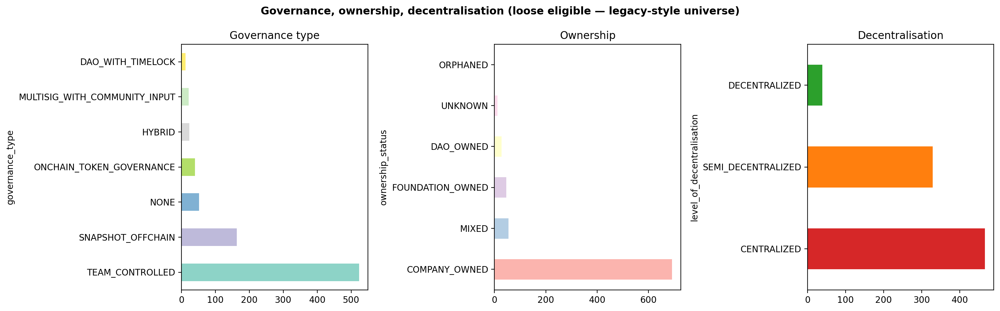

*Figure 4.1: Governance label distribution — loose universe (N=834)*

Figure 4.1 visualises the distribution of governance labels in the loose universe. The dominant category is company-owned, followed by team-controlled, with a small tail of DAO-governed and fully decentralised protocols. Figure 4.2 and Figure 4.3 present the corresponding governance × ownership and governance × token heatmaps for the loose universe, providing a visual baseline against which the strict-sample findings can be compared.

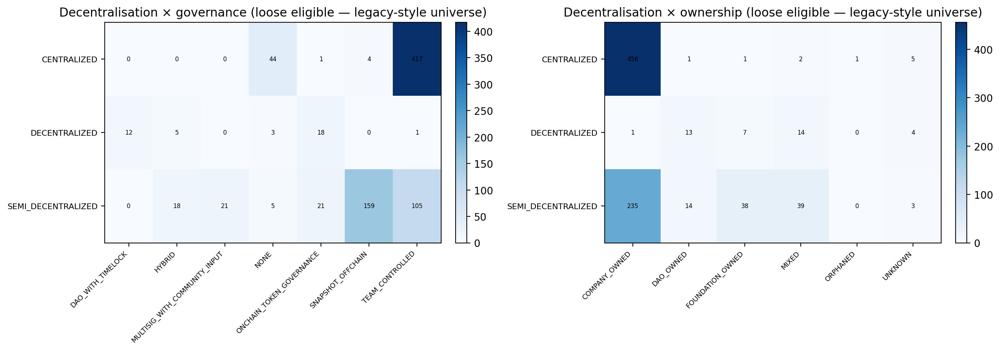

*Figure 4.2: Governance × ownership heatmap — loose backtest universe (N=834)*

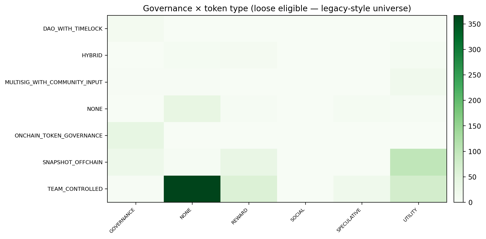

*Figure 4.3: Governance × token type heatmap — loose backtest universe (N=834)*

---

## 4.2 Governance and Ownership Structure

### 4.2.1 Distribution of Decentralisation Labels

Among the 68 DApps in the strict sample, the distribution of governance labels is substantially more varied than in the loose universe but remains concentrated well away from the "fully decentralised" ideal. Figure 4.4 presents the complete breakdown.

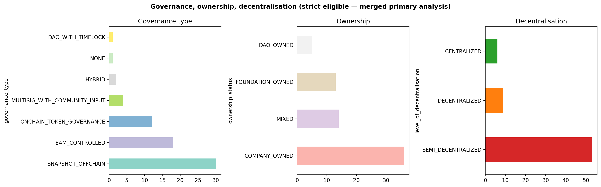

*Figure 4.4: Governance label distribution — strict universe (N=68)*

As shown in Table 4.1 and Figure 4.4, the strict sample is substantially more varied in governance structure than the loose universe but remains concentrated well away from the fully decentralised ideal. Key findings (INS-GOV-01, INS-GOV-02): 13.24 per cent fully decentralised (nine DApps), 52.94 per cent company-owned, 26.47 per cent team-controlled — together meaning **86.8 per cent of the strict sample are not fully decentralised**. This is the central empirical finding of the governance analysis: application-layer centralisation is the norm, not the exception, among DApps with sufficient scale and data quality.

The direction this finding implies for the field is consequential. Blockchain infrastructure is designed to be permissionless and censorship-resistant at the protocol layer, yet the DApps built upon it replicate concentrated governance structures that are in many respects structurally analogous to those of conventional Web2 companies. If the current trajectory continues — where fewer than one in seven large-scale DApps achieves genuine decentralisation — the decentralisation claim attached to the broader DApp ecosystem will increasingly describe the settlement layer rather than the user-facing application layer. This gap motivates the core thesis argument developed in Chapter 5: decentralisation is not an emergent property of blockchain deployment but a deliberate governance choice that requires competitive pressure, regulatory incentive, or institutional commitment to materialise at application scale.

The median governance score is 0.283 — more than four times the loose-universe median of 0.067 — yet still well below full decentralisation.

### 4.2.2 Ownership Concentration and Governance Type

Figure 4.5 presents the two-way cross-tabulations of governance dimensions for the strict sample, illustrating the co-occurrence patterns between governance type, ownership status, and level of decentralisation.

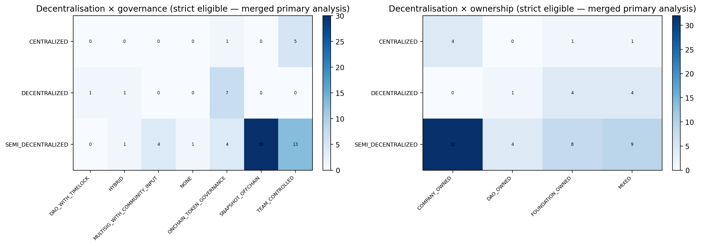

*Figure 4.5: Governance × ownership heatmap — strict sample (N=68)*

The heatmaps reveal systematic clustering in the governance space. Company-owned DApps are almost exclusively classified as team-controlled or founder-controlled in governance type; they rarely appear in DAO-governed or community-governed cells. Fully decentralised DApps, conversely, tend to be governed through on-chain token voting mechanisms (DAO with timelock or on-chain token governance) and lack a single company-owned identity. The off-diagonal cells — where ownership status and governance type diverge — are sparsely populated, indicating that these governance dimensions are largely co-determined rather than independent. This internal consistency supports the reliability of the manual coding procedure.

Table 4.2 presents the complete cross-tabulation of decentralisation level against governance type for the strict sample. Governance types are grouped into three analytically meaningful categories for presentation: on-chain governance (DAO with timelock and on-chain token governance), community/hybrid governance (hybrid structures, multisig with community input, and Snapshot-based off-chain governance), and team-controlled (no formal governance and team-controlled types).

**Table 4.2 — Cross-tabulation: decentralisation level × governance type, strict sample (N=68)**

| Decentralisation level | On-chain governance | Community / hybrid governance | Team-controlled | Total |
|----------------------|:-------------------:|:-----------------------------:|:---------------:|:-----:|
| DECENTRALIZED | 8 | 1 | 0 | **9** |
| SEMI\_DECENTRALIZED | 4 | 35 | 14 | **53** |
| CENTRALIZED | 1 | 0 | 5 | **6** |
| **Total** | **13** | **36** | **19** | **68** |

*On-chain governance = DAO with timelock (n=1) + on-chain token governance (n=12). Community/hybrid = hybrid (n=2) + multisig with community input (n=4) + Snapshot off-chain voting (n=30). Team-controlled = no formal governance (n=1) + team-controlled (n=18).*

The cross-tabulation confirms that all nine fully decentralised DApps are governed through on-chain mechanisms (eight) or hybrid community processes (one); none are team-controlled. Conversely, of the six centralised DApps, five are team-controlled and only one uses any on-chain governance mechanism — an incongruity likely reflecting a DApp that has deployed a governance token while operational authority remains concentrated. The SEMI\_DECENTRALIZED category (53 DApps, 77.9% of the strict sample) spans all three governance groups, with the plurality (35) using community or hybrid processes dominated by Snapshot off-chain voting (30 DApps within this row).

### 4.2.3 Token Type and Governance Co-Structure

Figure 4.6 extends the governance picture to include token classification, producing a view of how token design aligns with governance structure in the strict sample.

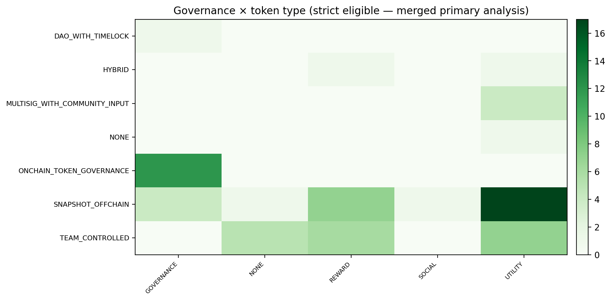

*Figure 4.6: Governance type × token type heatmap — strict sample (N=68)*

The heatmap reveals that on-chain token governance mechanisms are almost exclusively associated with governance-type tokens: all 12 DApps with ONCHAIN\_TOKEN\_GOVERNANCE governance type hold governance tokens, as does the sole DAO\_WITH\_TIMELOCK DApp. Conversely, team-controlled DApps hold no governance tokens — their tokens are classified as utility (n=7), reward (n=6), or absent (n=5). This alignment between governance token design and on-chain governance mechanisms represents an internal consistency that would be expected if token design tracks governance ambition.

However, a meaningful divergence appears in the SNAPSHOT\_OFFCHAIN row (30 DApps): four hold governance tokens, seventeen hold utility tokens, seven hold reward tokens, and one holds a social token. This indicates that off-chain governance via Snapshot is not primarily associated with governance token design — many DApps in this category retain utility or reward token structures despite operating a community voting process. The token design, in these cases, reflects financial engineering rather than governance architecture.

---

## 4.3 Market Structure and Capital Concentration

### 4.3.1 Distributional Properties of Market Capitalisation

The market capitalisation distribution of DApps in the full dataset is highly right-skewed. Across the 855-DApp sample, the mean market capitalisation is $71.8 million and the median is $6.9 million — a mean-to-median ratio of approximately 10.4, diagnostic of a fat-tailed distribution. A power-law regression across the full dataset yields an estimated exponent of α ≈ 0.61, consistent with a Pareto-like scaling regime in which a small number of very large protocols account for a disproportionate share of aggregate market value.

Figure 4.7 and Figure 4.8 illustrate the concentration and distributional structure of the strict and loose samples respectively.

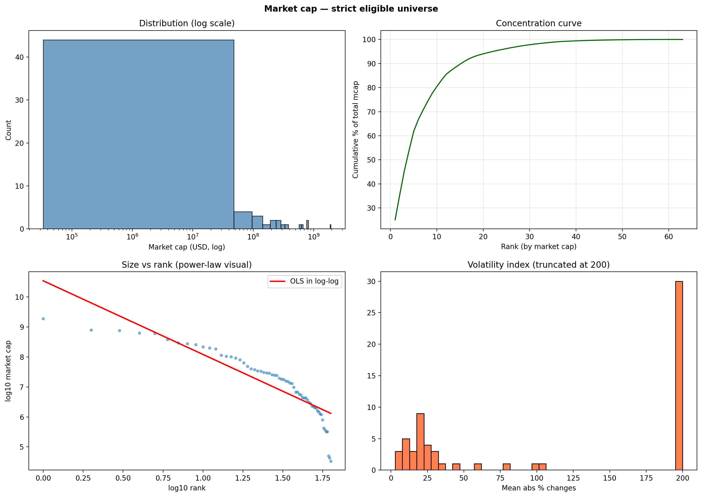

*Figure 4.7: Market capitalisation and user concentration — strict sample (N=68)*

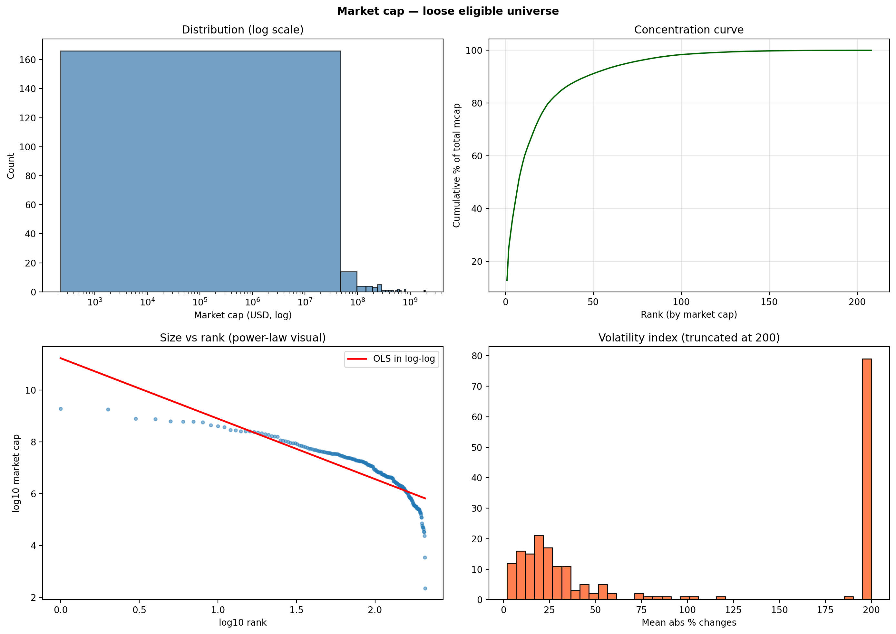

*Figure 4.8: Market dynamics — loose universe comparison (N=834)*

### 4.3.2 Top-10 Concentration Ratios

In the strict sample (N=68), the ten largest DApps by market capitalisation account for 80.46 per cent of the total market cap within that universe (INS-MKT-01), based on the 63 strict-eligible DApps for which market cap data are available. User concentration is even more pronounced: the ten most-active DApps by unique active wallets attract 90.14 per cent of strict-sample users (INS-ADP-01). These ratios are substantially higher than in the loose universe, where the top-10 market cap share is 57.54 per cent, because the strict filter retains only protocols with non-trivial financial metrics, which are predominantly the large incumbents.

TVL concentration mirrors these patterns. Total TVL across the full 855-DApp dataset is $115.7 billion, with the top ten protocols controlling approximately 93.1 per cent of that amount. Median TVL per user across the strict sample is $1,942, but this average conceals enormous variance: the highest-performing protocols by capital efficiency carry TVL-per-user ratios in the hundreds of thousands of dollars (reflecting institutional liquidity provision in DeFi), while many smaller DApps report near-zero TVL per wallet.

### 4.3.3 Structural Anomalies

Two structural anomalies in the market data merit specific attention.

**TVL exceeds market capitalisation (ANO-MKT-02).** Approximately 8.8 per cent of DApps in the strict sample exhibit TVL that exceeds their token market capitalisation. This inversion — where locked capital is worth more than the protocol's own equity — can arise from several mechanisms: rapid TVL accumulation preceding token price appreciation, artificial TVL inflation from looped collateral positions, or sustained depression of token prices relative to protocol utility. The phenomenon indicates that standard market cap figures do not always capture the full economic scale of a protocol and that TVL is a necessary complement to market cap when assessing DApp significance.

**Unfunded DApps outperform funded peers (ANO-MKT-03).** Within the strict sample (N=68), approximately 13 DApps raised documented venture capital. The median funding-to-valuation ratio for these funded DApps — measured as current market capitalisation divided by total capital raised — is 0.11×, meaning the median venture-backed DApp in the strict sample is currently valued at roughly one-tenth of the capital invested in it. At the same time, 29.4 per cent of the strict sample comprises unfunded DApps whose current market valuations exceed those of their venture-backed counterparts. Raises data is documented for only 38 of the full 855-DApp population (4.4 per cent), so full-dataset comparison is bounded to this verified subset; within it, $14.3 billion in documented capital was raised without producing a systematic positive relationship between capital raised and current market capitalisation. This pattern challenges the assumption that capital raised is a reliable predictor of DApp market success — a challenge this thesis attributes to the structural open-source dynamics of DApps, where permissionless forkability erodes the competitive moats that institutional valuations conventionally price in.

### 4.3.4 Governance–Performance Correlation

The Spearman rank correlation between the composite governance score and log-transformed market capitalisation across the strict sample is 0.38. While this association does not establish causality, it indicates that governance structure and market scale are not independent: DApps with higher governance scores tend to exhibit larger market capitalisations. DAO-governed DApps additionally show higher transaction intensity, and community governance is associated with more engaged user bases. Whether this reflects market participants rewarding governance quality, or whether financially successful DApps simply have greater resources to invest in governance formalisation, cannot be resolved from this cross-sectional dataset; the interpretive question is addressed in §5.2.

The directional signal from the data is clear, however: governance formalisation and market scale co-occur in the DApp ecosystem. The protocols that have reached the size and financial maturity required for strict-sample inclusion are disproportionately those that have invested in governance infrastructure. This co-occurrence is itself informative — it indicates that the market, however imperfectly, treats governance quality as a signal worth pricing — and it justifies the thesis's argument that governance structure should be treated as a first-class variable in DApp evaluation, not a compliance footnote.

---

## 4.4 Blockchain and Multi-Chain Deployment

### 4.4.1 Chain Distribution

The full 855-DApp dataset spans 77 blockchain networks. The five leading chains by DApp deployment count are BNB Chain (270 deployments, 11.9 per cent of total), Ethereum (221, 9.7 per cent), Polygon (192, 8.4 per cent), Base (176, 7.7 per cent), and Arbitrum (142, 6.2 per cent). The remaining 72 chains collectively account for the balance, with a long tail of single-digit deployment counts.

Figure 4.9 shows the top-15 chains by DApp presence in the strict sample.

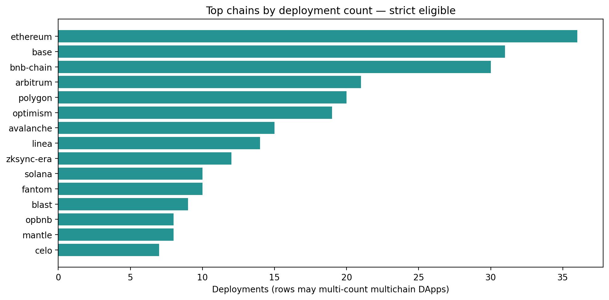

*Figure 4.9: Top-15 blockchain deployments — strict sample (N=68)*

Chain specialisation is evident across sectors. Ethereum and its EVM-compatible Layer-2 networks (Arbitrum, Optimism, Base) dominate the DeFi segment, where composability with established liquidity protocols and Ethereum's security budget provide structural network advantages. BNB Chain hosts a large share of gaming and NFT-gaming DApps, reflecting lower transaction costs and the presence of major gaming ecosystems in the Binance ecosystem. Solana and Sei concentrate gaming and high-throughput applications where transaction latency is a binding operational constraint.

### 4.4.2 Multi-Chain Adoption Rate

One of the most striking contrasts between the loose and strict universes concerns multi-chain deployment rates. In the loose universe, 36.21 per cent of DApps deploy across more than one chain. In the strict sample, this proportion rises to 70.59 per cent (INS-ADP-02) — nearly double. The increase is not mechanically implied by the strict filter's activity requirements, which operate at the DApp level rather than the chain level; rather, it reflects the fact that the most commercially active DApps are disproportionately those that have expanded across multiple blockchain networks. Among multi-chain DApps in the full dataset, the average number of supported chains is 5.7.

Across the full 855-DApp dataset, multi-chain DApps report an average market capitalisation of $80.2 million compared with $62.1 million for single-chain equivalents — a 1.3× premium. The causal interpretation of this premium is discussed in Chapter 5 (DIS-07); the directional finding is consistent across subsamples even if the mechanism remains ambiguous.

---

## 4.5 Sector-Level Performance

### 4.5.1 Sector Composition of the Strict Sample

The strict sample of 68 DApps is dominated by DeFi-tagged applications. Based on the theme-flag analysis, Table 4.21 summarises the sector composition and relative user share.

**Table 4.21 — Sector composition of the strict sample (N=68)**

| Sector | DApps | Share of strict sample | Share of strict-sample users |
|--------|:-----:|:----------------------:|:----------------------------:|
| DeFi | 39 | 57.35% | 54.33% |
| Gaming | 18 | 26.47% | 34.54% |
| Social | 3 | 4.41% | 0.70% |
| Other / uncategorised | 8 | 11.76% | 10.43% |
| **Total** | **68** | **100%** | **100%** |

*Other = NFT marketplace and infrastructure-adjacent protocols. User share computed from strict-sample active wallet totals.*

DeFi leads in protocol count but the Gaming sector punches above its weight in user share, foreshadowing the engagement gap discussed below. Figure 4.11 presents full sector-level performance metrics.

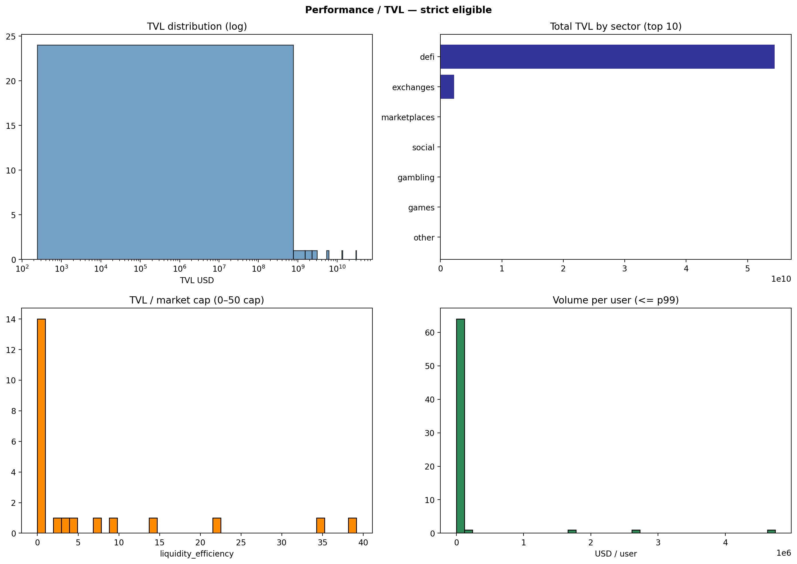

*Figure 4.11: Sector-level performance metrics — strict sample (N=68)*

### 4.5.2 The DeFi–Gaming Engagement Gap

The most economically significant sectoral contrast is the divergence between DeFi and gaming in value-per-user terms. In the strict sample (N=68), DeFi DApps process approximately $299.1 billion in total volume. Gaming DApps in the strict sample attract approximately 12,670,611 active users — the largest user base of any vertical — while generating comparatively modest financial throughput.

The implied value-per-user gap between these two sectors exceeds 1,000 times (ANO-ENG-01). This is not a marginal difference attributable to measurement error but a structural divide reflecting the distinct user populations and economic purposes of each vertical. DeFi wallets frequently represent participants deploying large capital positions in liquidity pools, yield strategies, and on-chain derivatives. Gaming wallets, by contrast, reflect engagement with in-game economies, NFT ownership, and play-to-earn mechanics — economically real but typically at the level of individual consumer transactions rather than institutional capital deployment.

The pattern is consistent across the full 855-DApp dataset (N=855). DEX-category DApps across the full dataset attract 36.8 million users and process $497.7 billion in volume, while gaming DApps across the full dataset collectively attract 23.8 million users and generate approximately $28 million in volume — a volume-per-user ratio roughly 630 times higher in the DEX category *(full dataset, N=855)*. User count and financial throughput therefore provide incompatible orderings of DApp success when applied across sector boundaries, and any league table or ranking that pools these metrics without sector disaggregation will generate misleading comparisons.

The scale of this divergence — exceeding 1,000× in economic value per user between DEX and gaming categories — is not a marginal measurement artefact but a structural indicator that DeFi and gaming represent fundamentally distinct economic architectures operating within the same nominal "DApp ecosystem." Any policy framework, investment thesis, or academic comparison that treats DeFi and gaming DApps as commensurable without sector disaggregation is working from an analytically misleading baseline. The thesis takes the position that DApp ecosystem health cannot be characterised by any single performance metric without first specifying the sector to which that metric is applied — a methodological constraint with direct implications for how researchers, regulators, and investors should design DApp evaluation frameworks.

### 4.5.3 Social and NFT DApps

Social-tagged DApps represent the smallest sector in the strict sample both by count (4.41 per cent of strict DApps) and by user share (0.70 per cent of strict-sample users). This marginalisation partly reflects the strict filter's user-count threshold: many social DApps remain small by on-chain user standards, as participants frequently interact through custodial front-ends that do not generate distinct wallet events. Across the full 855-DApp dataset, NFT marketplace protocols hold a more prominent position — second in user count behind DEX (17.1 million users, full dataset) and second in market cap ($864 million, full dataset) — but their reduced presence in the strict sample reflects both the user threshold and NFT trading volume volatility, which can push activity below strict-filter thresholds during quieter market periods.

---

## 4.6 Ecosystem Deep-Dives

The preceding sections characterise the DApp landscape through cross-sectional lenses — governance structure, market concentration, chain deployment, and sector-level performance gaps. This section provides complementary depth by examining five thematically distinct ecosystems: Decentralised Finance (DeFi), Prediction Markets, AI-native DApps, Real-World Assets (RWA), and Decentralised Physical Infrastructure (DePIN). Each ecosystem is governed by a distinct economic logic, user base, and governance trajectory; treating them as a homogeneous "DApp sector" would obscure the structural differences that aggregate analyses can only partially reveal.

*Sample note.* DeFi analysis draws on the 36 DApps in the strict high-signal sample classified under the DeFi ecosystem focus, supplemented by the 105-DApp loose-universe DeFi population where noted. Prediction Markets, AI-native DApps, RWA, and DePIN each contain fewer than 10 DApps in the strict sample (prediction markets: 1, AI: 3, DePIN: 2; RWA is embedded within DeFi and gaming categories); accordingly, the analysis for these four ecosystems uses the loose universe throughout and results should be interpreted in light of the correspondingly broader data-quality range.

**Table 4.20 — Cross-ecosystem structural comparison (loose universe)**

| Metric | DeFi (N=105) | Pred. Markets (N=31) | AI DApps (N=66) | RWA (N=43) | DePIN (N=29) |
|--------|:---:|:---:|:---:|:---:|:---:|
| % Team-controlled governance | 38.1% | **71.0%** | 54.5% | 60.5% | 55.2% |
| % Snapshot off-chain | 25.7% | 19.4% | **39.4%** | 20.9% | 34.5% |
| % On-chain governance | **17.1%** | 0% | 1.5% | 2.3% | 3.4% |
| % Fully decentralised (level) | **13.3%** | 0% | 0% | 2.3% | 6.9% |
| % Multi-chain deployment | **55.2%** | 19.4% | 40.9% | 37.2% | **55.2%** |
| % No native token | ~15% | **74.2%** | 24.2% | 55.8% | 37.9% |

*On-chain governance = DAO with timelock + on-chain token governance. Fully decentralised = DECENTRALIZED level classification. Bold = highest value in row. DeFi on-chain: 13.3 % OTG + 3.8 % DAO timelock = 17.1 %.*

The table shows three structural contrasts that recur throughout the ecosystem analyses:

1. **DeFi is the governance outlier** — highest on-chain governance prevalence (17.1 %) and the only ecosystem with a material fully-decentralised share (13.3 %).
2. **Prediction markets are the centralisation extreme** — 71.0 % team-controlled, zero fully decentralised DApps, the lowest multi-chain rate, and by far the highest no-token share (74.2 %).
3. **AI DApps trade team control for Snapshot signalling** — only 1.5 % on-chain, yet 39.4 % Snapshot off-chain, a configuration that signals community orientation while retaining operational authority.

The per-ecosystem sections below provide the contextual interpretation; quantitative comparisons should be read in conjunction with this table.

---

### 4.6.1 Decentralised Finance (DeFi)

DeFi represents the most economically significant sector in the dataset, hosting protocols whose aggregate TVL ($112.7 billion) accounts for 97.4 per cent of all DApp TVL and whose total trading volume ($358.0 billion) constitutes 68.5 per cent of dataset-wide volume. The 105 DeFi DApps in the loose universe span DEXes (automated market makers, order-book exchanges, aggregators), lending protocols, derivatives, yield aggregators, bridge/router infrastructure, and DAO tooling. Despite subcategory diversity they share a common structural foundation: composable open-source smart contracts deployed on EVM-compatible networks, where permissionless interoperability creates pressure toward governance formalisation as protocols accumulate value.

#### Chain Distribution: Ethereum as Settlement Anchor, Solana for High-Throughput DeFi

Table 4.4 presents the top-10 chains by DeFi DApp deployment count in the loose universe (N=105). Chains are counted per DApp per chain deployed; multi-chain DApps appear in each chain they occupy.

**Table 4.4 — Top-10 chains by DeFi DApp presence (loose universe, N=105)**

| Chain | DeFi DApps | Share of universe |
|-------|:----------:|:-----------------:|
| Ethereum | 52 | 49.5% |
| Base | 41 | 39.0% |
| BNB Chain | 41 | 39.0% |
| Arbitrum | 40 | 38.1% |
| Polygon | 34 | 32.4% |
| Optimism | 32 | 30.5% |
| Avalanche | 26 | 24.8% |
| zkSync Era | 23 | 21.9% |
| Linea | 21 | 20.0% |
| Solana | 20 | 19.0% |

*Note: Percentages sum to more than 100% because multi-chain DApps are counted in each chain they deploy on.*

Ethereum's primacy reflects its role as the canonical smart-contract environment — it serves as collateral, liquidity, and trust anchor for a large share of DeFi protocols even when execution migrates to Layer-2 rollups. Solana's entry at 19.0 per cent is driven primarily by high-throughput DEX aggregators (Jupiter Exchange, 3.0 million users) and launchpad protocols (Pump.fun, 7.1 million users) whose UX requirements favour sub-second finality. The 55.2 per cent multi-chain adoption rate in the DeFi universe (compared with 36.2 per cent across all sectors) confirms that DeFi protocols migrate aggressively toward capital and user density wherever it appears. See also Figure 4.9 for the chain distribution in the strict sample.

#### Key DApps: Spanning Launchpads, Aggregators, and Yield Markets

Table 4.5 presents the top DeFi DApps by active users in the loose universe, illustrating the range of protocol types operating at scale.

**Table 4.5 — Top DeFi DApps by active users (loose universe)**

| DApp | Users | Volume | TVL | Governance | Token |
|------|------:|-------:|----:|:----------:|:-----:|
| Pump.fun | 7,076,435 | $900.1M | — | TEAM\_CONTROLLED | UTILITY |
| Jupiter Exchange | 3,044,937 | $373.7M | — | ONCHAIN\_TOKEN\_GOVERNANCE | GOVERNANCE |
| HOT Protocol | 2,080,513 | $34.2M | — | HYBRID | UTILITY |
| PancakeSwap V3 | 627,839 | $81.4B | — | SNAPSHOT\_OFFCHAIN | UTILITY |
| Jumper Exchange | 519,380 | $3.5B | — | TEAM\_CONTROLLED | — |
| 1inch Network | 363,704 | $12.8B | — | MULTISIG\_WITH\_COMMUNITY\_INPUT | UTILITY |
| Pendle | 270,925 | $6.9B | $9.6B | ONCHAIN\_TOKEN\_GOVERNANCE | GOVERNANCE |
| Aave V3 | — | — | — | ONCHAIN\_TOKEN\_GOVERNANCE | GOVERNANCE |

#### Governance Maturity: Highest On-Chain Rate Across All Ecosystems

Among the 36 strict-sample DeFi DApps, governance is substantially more mature than the cross-ecosystem average. On-chain mechanisms (DAO with timelock and on-chain token governance) account for approximately 30 per cent of strict-sample DeFi protocols, compared with 19.1 per cent across the full strict sample. Table 4.6 presents the full governance distribution across the loose DeFi universe.

**Table 4.6 — DeFi governance distribution (loose universe, N=105)**

| Governance type | Count | Share |
|-----------------|:-----:|:-----:|
| TEAM\_CONTROLLED | 40 | 38.1% |
| SNAPSHOT\_OFFCHAIN | 27 | 25.7% |
| ONCHAIN\_TOKEN\_GOVERNANCE | 14 | 13.3% |
| MULTISIG\_WITH\_COMMUNITY\_INPUT | 11 | 10.5% |
| DAO\_WITH\_TIMELOCK | 4 | 3.8% |
| HYBRID | 4 | 3.8% |
| NONE | 5 | 4.8% |
| **Total** | **105** | **100%** |

*Source: governance type classification, loose DeFi universe.*

DeFi has the highest fully decentralised rate of any ecosystem (13.3 %, see Table 4.20). This is consistent with competitive pressure to establish credible neutrality: protocols modifiable at will by their team face user flight to formally governed alternatives. The Snapshot off-chain plurality (25.7 %) represents an intermediate stage — token-holder voting is possible but execution remains operator-dependent (Figures 4.5 and 4.6).

#### Token Model Patterns: Utility Plurality with Governance Token Minority

Utility tokens dominate at 44.8 per cent, reflecting governance-adjacent but non-voting token designs used primarily for fee discounts, liquidity incentives, and staking rewards. Governance tokens appear in 19.0 per cent of DeFi DApps in the loose universe, rising to approximately 31 per cent in the strict sample, where the most financially mature protocols are concentrated. The analysis confirms that 55 per cent of strict-sample DeFi DApps have issued a governance token. Token-holder value accrual is present in approximately 44 per cent of those cases — a lower share, indicating that governance token issuance frequently precedes fee-switch activation.

#### Revenue Logic: Transaction Fees, Interest Margin, and Spread Arbitrage

Three dominant DeFi revenue mechanisms are identified in the strict sample:

1. *Transaction fees* (20/36 strict DeFi DApps = 55.6 per cent): DEXes charge a percentage of swap volume (typically 0.01–0.30 per cent for AMMs; protocols with volume above $1 billion include Raydium, Pump.fun, PancakeSwap, 1inch, Jupiter Exchange, and SushiSwap).

2. *Interest margin* (6/36 = 16.7 per cent): Lending and yield protocols (Aave V3, Morpho, Maple, Moonwell, ZeroLend, Velo) earn the spread between borrower and lender rates.

3. *Spread arbitrage* (5/36 = 13.9 per cent): Aggregators and bridge protocols (1inch, Mento, Velora, ParaSwap, OpenOcean) capture positive price differences between routes during execution, booking the remainder as protocol revenue.

#### Registered Anomalies

**ANO-DeFi-01 — TVL-to-Market-Cap Inversion**

Six strict-sample DeFi DApps (Pendle, Morpho, Maple, KernelDAO, EigenLayer, LIDO) exhibit TVL that materially exceeds their token market capitalisation, with Morpho reaching a TVL/MCap ratio of approximately 3,437× (TVL $187.5 billion vs MCap at data capture). This pattern is most acute for protocols serving as infrastructure for other protocols' liquidity — TVL accumulates through recursive collateral loops without commensurate token appreciation. The phenomenon is catalogued as ANO-MKT-02 in the broader dataset.

**ANO-DeFi-02 — Team-Controlled Launchpad at Scale**

Pump.fun is the most-used DeFi DApp by active users (7.1 million) yet operates under TEAM\_CONTROLLED governance with a utility token. This inversion of the assumed decentralisation-scale relationship reflects the economics of memecoin launchpads: rapid iteration, content moderation, and fee-structure changes require centralised authority to remain competitive. The protocol's $900 million monthly volume demonstrates that high revenue is achievable without governance formalisation.

**ANO-DeFi-03 — Revenue Concentration in Non-Governance Protocols**

Among the five highest-volume DeFi DApps (Pump.fun, PancakeSwap V3, Jumper Exchange, Morpho, Helix), three are team-controlled or hybrid-governed. This indicates that revenue generation is not monotonically associated with governance maturity: the protocols capturing the greatest economic throughput are not necessarily those with the most formal governance structures.

---

### 4.6.2 Prediction Markets

Prediction markets constitute a small but analytically significant ecosystem: 31 DApps identified in the loose universe, with sector activity dominated by a single protocol. Polymarket accounts for 66.6 per cent of all prediction-market user activity and 95.3 per cent of sector volume ($858.8 million of $900.7 million total). The sector sits within the DappRadar gambling sector taxonomy — a classification choice that introduces a comparability caveat, since protocols that aggregate forecasts on political events, sports outcomes, or macroeconomic releases share the economic and informational function of financial derivatives, not casino wagering.

*Sample limitation.* Prediction market DApps overwhelmingly lack the financial metrics required for strict-sample inclusion. Polymarket — the dominant protocol — operates without a native token and without reportable TVL, disqualifying it from the strict filter. Only one strict-sample prediction market DApp is identified (Overtime Markets). The analysis uses the loose universe (N=31) throughout.

#### Chain Distribution: Polygon for Oracle-Dependent Resolution, BNB Chain for Broader Reach

**Table 4.7 — Top-5 chains by prediction market DApp presence (loose universe, N=31)**

| Chain | DApps | Share |
|-------|:-----:|:-----:|
| BNB Chain | 8 | 25.8% |
| Base | 6 | 19.4% |
| Polygon | 5 | 16.1% |
| Solana | 4 | 12.9% |
| Arbitrum | 3 | 9.7% |

*Note: multi-chain DApps counted per chain.*

Polygon hosts Polymarket — migrated from Ethereum in 2020 to reduce gas costs for individual resolution transactions. The multi-chain adoption rate for prediction markets (19.4 per cent) is the lowest of the five ecosystems examined, reflecting both the informational complexity of deploying oracle-dependent resolution across chains and the relative maturity barrier of the sector.

#### Key DApps: Polymarket Dominates with 66.6% of Sector Users

**Table 4.8 — Top prediction market DApps by active users (loose universe)**

| DApp | Users | Volume | Gov. type | Token | Chain |
|------|------:|-------:|:----------:|:-----:|-------|
| Polymarket | 215,114 | $858.8M | TEAM\_CONTROLLED | — | Polygon |
| CricSage | 59,934 | — | TEAM\_CONTROLLED | — | Skale-Nebula |
| Overtime | 32,296 | $24.8M | MULTISIG\_WITH\_COMMUNITY\_INPUT | UTILITY | Arbitrum/Base/Optimism |
| Predictions (PRDT) | 5,141 | $12.8M | SNAPSHOT\_OFFCHAIN | UTILITY | Multi-chain |
| Limitless | 3,153 | $3.6M | SNAPSHOT\_OFFCHAIN | UTILITY | Base |
| BetSwirl | 1,663 | $0.4M | TEAM\_CONTROLLED | UTILITY | Multi-chain |

#### Governance Maturity: Most Centralised Ecosystem — 71.0% Team-Controlled

**Table 4.9 — Prediction market governance distribution (loose universe, N=31)**

| Governance type | Count | Share |
|-----------------|:-----:|:-----:|
| TEAM\_CONTROLLED | 22 | 71.0% |
| SNAPSHOT\_OFFCHAIN | 6 | 19.4% |
| NONE | 2 | 6.5% |
| MULTISIG\_WITH\_COMMUNITY\_INPUT | 1 | 3.2% |
| **Total** | **31** | **100%** |

*Source: governance type classification, loose prediction market universe.*

Prediction markets are the most centralised ecosystem (Table 4.20): 71.0 per cent team-controlled, zero DApps fully decentralised. This reflects a genuine operational constraint — outcome resolution requires rapid, authoritative intervention to correct oracles and arbitrate disputes, functions that slow token-governance processes cannot reliably provide.

#### Token Model Patterns: Near-Total Absence of Governance Tokens (74.2% Tokenless)

The sector is notable for near-total absence of governance tokens: 74.2 per cent of prediction market DApps carry no native token. Among tokenised protocols, utility tokens predominate (19.4 per cent). This token-free design is commercially rational: a native token would introduce speculative dynamics into a platform whose value proposition depends on price-neutral information aggregation. The single strict-sample prediction market DApp (Overtime) uses a utility token with multisig-guarded community input rather than on-chain token governance, consistent with the sector pattern.

#### Revenue Logic: Resolution Fees, Spread Arbitrage, and Oracle Services

The dominant revenue mechanism for prediction market protocols is spread arbitrage. Protocols earn through: (1) *resolution fees* charged as a percentage of the settled market's volume (typically 2–5 per cent on winning positions); (2) *spread arbitrage* between taker and maker pricing in AMM-style prediction markets (Overtime's model); and (3) *oracle service fees* in protocols that route resolution through UMA, Chainlink, or other providers. Polymarket's $858.8 million in volume at a 2 per cent fee structure implies approximately $17.2 million in annual fee revenue for a tokenless, team-controlled operator.

#### Registered Anomalies

**ANO-PRED-01 — Volume-Per-User Concentration: Polymarket's Institutional Wagering Profile**

Polymarket's implied volume-per-user is $3,992, placing it in the high-volume-per-user outlier category alongside major institutional DeFi protocols. This ratio is driven by large-position wagering on high-stakes events — US elections, sports tournaments, macroeconomic releases — rather than retail participation breadth, and is not representative of the sector median.

**ANO-PRED-02 — Extreme Volume Outlier: "Trade Signal" Institutional Order Flow**

One prediction-market-adjacent DApp ("Trade signal", classified within the gambling and NFT marketplace sectors) records $1.861 billion in volume against only 1,131 active users — a volume-per-user ratio of $1,645,485, the highest registered outlier in the dataset. This extreme ratio is consistent with a front-end routing institutional order flow rather than reflecting genuine broad user activity, and the DApp carries no formal governance mechanism and no token.

---

### 4.6.3 AI-Native DApps

#### Sector Definition and Inclusion Criteria

**Inclusion criteria.** A DApp is classified as AI-native if any combination of its descriptive text fields contains at least one of the following terms: *ai*, *llm*, *machine learning*, *ai gaming*, or *ai-big-data* (case-insensitive). The classification is applied mechanically, evaluating the combined text of all relevant descriptive fields per DApp.

**Exclusion criteria.** DApps excluded from the AI-native cohort despite surface-level AI language are those where: (a) the term "AI" appears only in a DApp name or mascot without reference to ML inference or AI-agent functionality in any documented feature (several memecoin or branding-only cases); or (b) the DApp is already captured in the Prediction Market or DePIN/RWA themes and does not independently qualify through the AI keyword rules. No manual override of the mechanical mask was applied; the 66 eligible DApps are the complete output of the inclusion rule applied to the loose universe.

**Functional definition.** An AI-native DApp, for the purposes of this thesis, is a blockchain-based application whose documented primary or secondary feature set incorporates machine-learning inference, AI-agent coordination, or AI-generated content as a core component of the user experience — whether delivered on-chain, through a hybrid on/off-chain architecture, or via an AI model accessed through a protocol-controlled API. This definition intentionally spans the heterogeneous sub-types identified in the dataset: AI gaming integrations (Hot Spring — The Cozy World, Sleepless AI, FishWar), autonomous AI-agent infrastructure and launchpads (Virtuals Protocol, ChainOpera AI), AI-powered data annotation and contribution platforms (Alaya AI), AI-enhanced social and content tools (Kaito, Sogni AI, CARV), and AI-adjacent security and developer tooling (ChainGPT, ZoRobotics).

*Sample limitation.* The v2 dataset identifies three strict-sample AI DApps: ChainOpera AI, Virtuals Protocol, and ChainGPT. The analysis uses the loose universe (N=66) throughout, with strict-eligible DApps noted where relevant.

---

#### Sector Structure: NFT Gaming and Marketplace Lead, Cross-Cutting Classification Gap

The 66 AI-native DApps span nine primary sectors. The "other" sector holds the plurality (29 DApps, 43.9 per cent) — consistent with the cross-cutting, hard-to-classify nature of AI-enabled applications that do not fit neatly into DeFi, gaming, or social taxonomies. NFT Gaming (16 DApps) and NFT marketplace (13 DApps) are the most represented application categories, reflecting the early-adoption of AI features in gaming reward economies and AI-generated content marketplaces.

**Table 4.10 — AI DApp distribution by application category (loose universe, N=66)**

| Category | Count | Share |
|----------|:-----:|:-----:|
| NFT Gaming | 16 | 24.2% |
| NFT marketplace | 13 | 19.7% |
| Social Network | 11 | 16.7% |
| Infrastructure | 7 | 10.6% |
| DAO Tooling | 5 | 7.6% |
| DEX | 4 | 6.1% |
| SocialFi | 3 | 4.5% |
| Metaverse | 2 | 3.0% |
| Other categories | 5 | 7.6% |

*Source: AI DApp theme universe.*

Three functionally distinct archetypes account for the majority of the AI DApp population:

1. **AI gaming and reward-economy applications** (approximately 30–35 DApps): Integrate AI-generated environments, AI non-player characters (NPCs), or AI-scored tasks into play-to-earn or move-to-earn models. Revenue is deferred to token appreciation; on-chain volume is near zero despite high user counts.

2. **AI infrastructure and agent platforms** (approximately 7–10 DApps): Provide compute, model access, or agent-launch infrastructure to other protocols. Revenue is fee-based (usage metering, launchpad take-rate). Market capitalisation is disproportionately high relative to user counts, as markets price platform optionality on the AI-agent economy.

3. **AI-enhanced social and content platforms** (approximately 15–20 DApps): Apply AI to content recommendation, community moderation, or user-generated AI art. Governance is most frequently Snapshot off-chain; token models lean toward utility or governance-adjacent designs.

---

#### Chain Distribution: BNB Chain for Gaming, Base for AI Infrastructure

**Table 4.11 — Top chains by AI DApp deployment (loose universe, N=66)**

| Chain | Deployments | Share of AI cohort |
|-------|:-----------:|:------------------:|
| BNB Chain | 26 | 39.4% |
| Base | 22 | 33.3% |
| Ethereum | 21 | 31.8% |
| Arbitrum | 13 | 19.7% |
| opBNB | 12 | 18.2% |
| Polygon | 10 | 15.2% |
| Solana | 7 | 10.6% |
| Linea | 5 | 7.6% |

*Note: multi-chain DApps are counted once per chain; shares do not sum to 100%.*

BNB Chain's leading position (39.4 per cent of AI DApps) is driven by the preponderance of AI gaming and reward-economy applications targeting the Telegram Mini App and opBNB micro-transaction ecosystems. opBNB itself ranks fifth (18.2 per cent) as the preferred scaling chain for gaming reward distributions that require sub-cent transaction fees. Base's strong showing (33.3 per cent) reflects the concentration of venture-backed AI infrastructure and agent-platform projects on Coinbase's L2 — Virtuals Protocol, its largest AI DApp by market cap, launched on Base and has attracted derivative agent projects to the same chain. The 40.9 per cent multi-chain adoption rate sits above the prediction market baseline (19.4 per cent) and roughly in line with the cross-ecosystem average (36.2 per cent), but well below the DeFi sector rate of 55.2 per cent — suggesting that AI DApps chain-select for user acquisition and cost rather than for financial composability.

---

#### Key DApps: Extreme Scale Gaps Across AI Archetypes

**Table 4.12 — Representative AI DApps by active users (loose universe)**

| DApp | Users | Volume | MCap | Gov. type | Token | Archetype |
|------|------:|-------:|-----:|:----------:|:-----:|:--------:|
| Hot Spring — The Cozy World | 2,924,351 | — | — | HYBRID | REWARD | Gaming/reward |
| Alaya AI | 1,869,774 | — | — | TEAM\_CONTROLLED | UTILITY | Data/reward |
| FishWar | 560,738 | $0.9M | $0.3M | TEAM\_CONTROLLED | REWARD | Gaming/reward |
| OpenPad AI | 293,016 | — | — | TEAM\_CONTROLLED | — | Social/tools |
| ChainOpera AI | 162,072 | $0.1M | $105.5M | SNAPSHOT\_OFFCHAIN | — | Infrastructure |
| Sleepless AI | 73,338 | — | $19.9M | SNAPSHOT\_OFFCHAIN | REWARD | Gaming/reward |
| Virtuals Protocol | 39,464 | $7.8M | $606.3M | ONCHAIN\_TOKEN\_GOVERNANCE | GOVERNANCE | Infrastructure |
| Kaito | ~18,000 | — | $161.4M | SNAPSHOT\_OFFCHAIN | GOVERNANCE | Social/tools |
| ChainGPT | 20,145 | $0.3M | $34.5M | SNAPSHOT\_OFFCHAIN | UTILITY | Infrastructure |

---

#### Governance Structure: Bimodal Distribution — Team Control or Snapshot Off-Chain

**Table 4.13 — AI DApp governance distribution (loose universe, N=66)**

| Governance type | Count | Share |
|-----------------|:-----:|:-----:|
| TEAM\_CONTROLLED | 36 | 54.5% |
| SNAPSHOT\_OFFCHAIN | 26 | 39.4% |
| NONE | 2 | 3.0% |
| HYBRID | 1 | 1.5% |
| ONCHAIN\_TOKEN\_GOVERNANCE | 1 | 1.5% |
| **Total** | **66** | **100%** |

*Source: governance type classification, AI DApp theme universe.*

AI DApps exhibit a strongly bimodal governance distribution: protocols are either fully team-controlled (54.5 %) or rely on Snapshot off-chain voting (39.4 %). On-chain governance is represented by a single DApp (Virtuals Protocol, 1.5 %) — well below the 6.4 % cross-ecosystem baseline (Table 4.20). The disproportionate Snapshot share (39.4 % versus 17.5 % for non-AI DApps) suggests teams signal community orientation through off-chain voting while retaining operational authority. Research annotations confirm: FishWar — "no evidence of binding on-chain DAO; team likely executes"; ZoRobotics — "practical control remains with project team today"; ChainOpera AI — "execution still team-led at present."

By ownership structure, 86.4 per cent of AI DApps are COMPANY\_OWNED — the highest of any thematically defined sub-group in the dataset. A single DApp (Treasure, 1.5 per cent) is DAO\_OWNED; two are FOUNDATION\_OWNED. This near-universal corporate ownership confirms that the AI DApp sector is, in practical terms, a corporate software sector with blockchain token issuance rather than a community-governed decentralised application sector.

**Governance comparison with non-AI ecosystem**

| Metric | AI DApps (N=66) | Non-AI ecosystem (N=789) |
|--------|:---------------:|:------------------------:|
| Team-controlled | 54.5% | 64.3% |
| Snapshot off-chain | 39.4% | 17.5% |
| On-chain governance (any) | 1.5% | 6.4% |
| Company-owned | 86.4% | 82.8% |
| DAO-owned | 1.5% | 2.8% |

The AI sector is slightly *less* team-controlled than the non-AI DApp universe, but achieves this lower rate through Snapshot off-chain mechanisms rather than through formal on-chain governance — a lateral move within the centralised governance zone rather than progress toward decentralisation.

---

#### Decentralisation Analysis: The Zero Fully Decentralised Finding

*This section addresses the finding noted in the thesis goal annotation: zero fully decentralised AI DApps in the loose universe.*

No AI DApp in the 66-DApp cohort achieves the Decentralised classification under the coding framework used in this thesis (which requires: on-chain governance with binding token-weighted voting, open participation, and at least semi-independent protocol execution). The decentralisation distribution is:

**Table 4.14 — Decentralisation levels: AI DApps versus full ecosystem**

| Decentralisation level | AI DApps (N=66) | AI share | Full ecosystem (N=855) | Ecosystem share |
|------------------------|:---------------:|:--------:|:----------------------:|:---------------:|
| CENTRALIZED | 28 | 42.4% | 486 | 56.8% |
| SEMI\_DECENTRALIZED | 38 | 57.6% | 330 | 38.6% |
| DECENTRALIZED | **0** | **0.0%** | 39 | **4.6%** |

*Source: decentralisation level classification.*

The zero-decentralised finding is not a data artefact. Four independent structural explanations account for it:

**1. Off-chain AI computation as an inherent centralisation vector.** AI inference — whether large language model inference, computer vision, or reinforcement learning — requires substantial off-chain compute. Model weights, training data, and inference endpoints reside on centralised infrastructure (cloud providers or team-operated servers). The Decentralised coding tier requires that protocol execution can function without a central operator. Because the AI inference layer cannot satisfy this requirement with current technology, any DApp whose core functionality depends on AI inference cannot meet the threshold for full decentralisation, regardless of its financial governance structure. This is not a policy choice but a technical constraint of the current AI-blockchain integration paradigm.

**2. Youth of the sector and governance lifecycle position.** The 39 fully decentralised DApps in the broader loose universe are predominantly mature DeFi protocols (Compound, Aave, Uniswap, and their structural analogues) that have traversed a multi-year governance evolution from team control to Snapshot voting to DAO-with-timelock to on-chain self-execution. The AI DApp cohort is concentrated in the 2023–2025 launch window — a period too early for the governance lifecycle to have progressed to the Decentralised tier. Among the 35 fully decentralised non-AI DApps in the DeFi and exchanges sectors, the governance tenure spans three to seven years; the modal AI DApp has governance tenure under two years.

**3. Near-universal corporate ownership constrains governance trajectory.** With 86.4 per cent of AI DApps COMPANY\_OWNED and a single DAO\_OWNED DApp, the ownership structure creates a practical impediment to decentralisation: corporate ownership entities typically retain IP rights, model update authority, and regulatory compliance obligations that are legally incompatible with ceding control to an autonomous DAO. The DeFi protocols that achieved full decentralisation did so by relinquishing corporate control through foundation structures or pure smart-contract deployment — a step that AI-sector companies have not taken, in part because AI model governance (safety updates, capability restrictions) requires a responsible legal entity.

**4. Regulatory and safety imperatives for centralised override.** AI systems require the ability to roll back or patch deployed models in response to safety incidents, capability misuse, or regulatory directives (e.g., EU AI Act obligations on high-risk AI systems). This override requirement is structurally incompatible with the governance immutability that characterises fully decentralised on-chain protocols, where code changes require token-holder supermajority approval with timelock delays. The research comment for ZoRobotics is illustrative: the team "markets DAO-based validation; practical control remains with project team today" — a configuration that likely reflects not only product maturity but also a deliberate preservation of team-override authority.

**The Virtuals Protocol paradox.** Virtuals Protocol is classified as ONCHAIN\_TOKEN\_GOVERNANCE — the most formally governed AI DApp in the dataset — yet remains coded CENTRALIZED. The research annotation reads: "eVIRTUAL tokenholders vote on-chain; DAO/forum active; team still builds products but governance powers sit with veVIRTUAL holders → high decentralization." This constitutes a borderline case: the governance mechanism is on-chain, but the AI agent curation and platform operational decisions remain team-led. The CENTRALIZED rating reflects the current state of operational control rather than the governance architecture alone — a distinction that highlights the insufficiency of formal governance apparatus as a proxy for effective decentralisation in AI-native protocols.

**INS-AI-01 — Structural impossibility of fully decentralised AI DApps under current technology.** The zero-decentralised finding warrants formalisation as a sector-level insight: *fully decentralised AI-native DApps are a theoretical category that the 2023–2025 technology stack cannot realise*. Decentralised AI inference (homomorphic encryption of model weights, fully verifiable on-chain ML execution, or comparable approaches) remains a research problem rather than a deployed product. Until these compute primitives mature, the AI DApp sector will structurally occupy the CENTRALIZED or SEMI\_DECENTRALIZED tiers regardless of governance maturation, and performance comparisons with the DECENTRALIZED tier of the broader DApp universe are not meaningful.

---

#### Token Model Patterns: High Token Issuance (75.8%) Against Limited Governance Rights

Of the 66 AI DApps, 50 (75.8 per cent) have issued a token. The remaining 16 (24.2 per cent) are tokenless — a higher no-token rate than the DeFi sector (approximately 15 per cent) but lower than prediction markets (approximately 40 per cent).

**Table 4.15 — AI DApp token type distribution (token-issuing DApps, N=50)**

| Token type | Count | Share of token-issuers |
|------------|:-----:|:----------------------:|
| UTILITY | 28 | 56.0% |
| REWARD | 10 | 20.0% |
| GOVERNANCE | 6 | 12.0% |
| SPECULATIVE | 3 | 6.0% |
| GOVERNANCE + UTILITY | 2 | 4.0% |
| SOCIAL | 1 | 2.0% |

*Source: token type classification.*

Utility tokens dominate (56.0 per cent of token-issuers; 42.4 per cent of the full cohort), consistent with AI DApps using tokens primarily to gate access to AI services, distribute compute credits, and incentivise data contributions. Reward tokens (20.0 per cent of token-issuers) are concentrated in gaming-adjacent AI applications that distribute tokens for AI-beneficial tasks: data labelling (Alaya AI), physical movement (Sleepless AI), and play-to-earn completion (Hot Spring — The Cozy World, FishWar). Pure governance tokens appear in 12.0 per cent of token-issuing AI DApps (6 DApps) — a low governance-token prevalence consistent with the sector's limited formal governance development. The cross-cohort governance token prevalence stands at 12.1 per cent, aligned with this range.

No AI DApp in the dataset operates a pure fee-switch governance token model (where governance rights map directly to protocol revenue claims) at scale — the closest approximation is Virtuals Protocol's veVIRTUAL staking, which grants governance votes and fee-distribution rights but within a corporate-controlled product environment.

---

#### Revenue Logic: Usage Metering, Agent Launch Take-Rate, and Tokenomics Subsidies

AI DApp revenue divides into three models, identified for the three strict-sample DApps and extended analytically to the loose universe:

1. **Usage metering**: ChainOpera AI and ChainGPT charge compute credits for API-accessible AI inference, operating on fee and subscription revenue models respectively. This model mirrors enterprise SaaS pricing applied to on-chain-accessible AI services. It is financially sustainable but concentrates revenue in the infrastructure sub-type rather than the broad AI DApp population.

2. **Take-rate on agent launches**: Virtuals Protocol charges a percentage of initial bonding-curve liquidity when AI agents are launched on its platform. This model is analogous to token launchpad fees but applied to autonomous agent primitives, enabling revenue proportional to the growth of the AI agent economy.

3. **Tokenomics-subsidised engagement** (majority of the loose-universe AI DApps): Hot Spring, Alaya AI, FishWar, and most large-user-count AI DApps distribute reward tokens for in-application activity rather than extracting fees. This is a user-acquisition model that defers monetisation to token appreciation and secondary-market activity — a structure with positive cash flow only if token markets sustain or appreciate, an assumption that holds during bull markets but collapses during contractions.

---

#### Maturity Indicators: Data-Complete but Financially Thin

Assessed across the standard maturity dimensions used in this thesis:

| Metric | AI DApps (N=66) | Full loose universe (N=855) |
|--------|:---------------:|:---------------------------:|
| Median active users | 1,232 | ~2,400 |
| Median volume (USD) | $785 | ~$28,000 |
| Multi-chain rate | 40.9% | 36.2% |
| Mean activity signal count | 3.4 | ~3.1 |
| Data completeness score (mean) | 0.84 | ~0.79 |
| Token issuance rate | 75.8% | ~65% |

*Full-universe figures are derived from the full dataset for comparison.*

The AI DApp cohort is relatively data-complete (mean score 0.84) and slightly above average on activity signal count (3.4 versus ~3.1 ecosystem-wide), indicating that AI-branded projects attract sufficient analytic coverage to be reliably coded. However, median active users (1,232) and volume ($785) are well below ecosystem medians — reflecting the preponderance of early-stage or reward-economy protocols whose user activity does not generate financial throughput. Multi-chain adoption at 40.9 per cent is above the ecosystem median, consistent with AI DApps actively seeking broad user distribution across multiple L2 and L1 ecosystems.

The high token issuance rate (75.8 per cent) relative to the AI sector's governance and revenue maturity represents a structural tension: tokens are issued early — often as the primary incentive and funding mechanism — but governance and decentralisation infrastructure lag behind, producing a cohort in which most token-holders hold instruments that carry no meaningful governance rights in practice.

---

#### Registered Anomalies

**ANO-AI-01 — User–Volume Decoupling: Reward Economies Generate Activity Without Financial Throughput**

The two most-used AI DApps by active wallet count — Hot Spring (2.9 million users) and Alaya AI (1.9 million users) — report zero recorded volume. This decoupling indicates reward economies in which activity generates token distributions but not financial throughput traceable as on-chain "volume" in DappRadar's framework. The same pattern holds for OpenPad AI (293,016 users, $0 volume) and Sleepless AI (73,338 users, $0 volume), classifying these DApps as structurally incompatible with volume-based performance benchmarks calibrated on DeFi or NFT activity.

**ANO-AI-02 — Market-Capitalisation Inversion Relative to User Scale: Infrastructure Priced as Platform Options**

Virtuals Protocol carries a $606.3 million MCap with 39,464 active users (MCap-per-user ≈ $15,365), while Hot Spring has 2.9 million users and zero MCap. This near-perfect anti-correlation between financial valuation and user activity within the AI sector indicates that market participants price AI protocol infrastructure as platform options on the emerging AI-agent economy — not on revenue or user metrics. The total AI DApp combined market cap of $1.61 billion is dominated by the infrastructure sub-type (Virtuals Protocol, ChainOpera AI, Kaito, CARV) despite these protocols collectively holding fewer than 250,000 active users.

---

### 4.6.4 Frontier Ecosystems: RWA and DePIN

Real-World Assets (RWA) and Decentralised Physical Infrastructure (DePIN) represent the two smallest ecosystems in the dataset, with 43 and 29 DApps respectively in the loose universe and only 2–5 strict-eligible protocols across both categories. Because the strict filter excludes most protocols in these verticals — RWA protocols frequently lack native tokens; DePIN protocols rarely meet the TVL or volume thresholds — findings here are drawn from the loose universe and are descriptive rather than inferential.

**RWA** (N=43 loose) spans two economically distinct protocol types: *institutional DeFi* (Ethena, Maple — targeting capital-intensive participants) and *tokenised consumer assets* (Courtyard, WiFi Map — targeting retail participants through tokenised physical objects). Both types share a defining structural constraint: regulatory compliance for tokenised real-world assets typically requires a corporate legal custodian, which constrains governance toward centralisation. RWA is the second-most centralised ecosystem after prediction markets, with 60.5 per cent team-controlled governance, 55.8 per cent no-token share (highest of all ecosystems), and only 2.3 per cent fully decentralised — a profile consistent with the legal and operational exposure of protocols interfacing directly with regulated off-chain assets. Two structural anomalies stand out. *ANO-RWA-01:* Ethena's TVL ($14.2 billion) exceeds its market capitalisation ($1.8 billion) by 7.8×, because sUSDe deposits represent depositor liabilities rather than protocol equity. *ANO-RWA-02:* Maple's 30-day volume ($34.3 billion) exceeds its TVL ($2.6 billion) by 13.1×, indicating capital velocity through revolving institutional lending cycles rather than passive lock-up — the directional inverse of the TVL-leverage anomaly documented in §4.9.4.

**DePIN** (N=29 loose) coordinates physical hardware through token-incentivised networks: wireless data sharing (WiFi Map, XPIN Network), fitness tracking (Sweat Economy, SuperWalk), gaming hardware (Gaimin), and messaging infrastructure (Dmail Network). The sector mirrors RWA in governance centralisation (55.2 per cent team-controlled) but differs structurally in user scale: 4.9 million active users generate only $8.6 million in total volume — an average of $1.74 per user, the lowest of any sector (*ANO-DEPIN-01*). This confirms the category error introduced when DePIN is evaluated against DeFi-calibrated volume benchmarks. One governance novelty is worth recording: Sweat Economy achieves Hybrid decentralisation through a "one-person, one-vote" model enforced by physical activity verification — a mechanism with no precedent in the DeFi governance literature and one that raises an open question about whether standard decentralisation metrics apply across DePIN governance architectures (*ANO-DEPIN-02*).

Table 4.20 at the head of §4.6 provides the cross-ecosystem quantitative comparison that situates RWA and DePIN relative to the three primary ecosystems. The directional takeaway is consistent with the thesis's governance finding: centralisation is the norm in frontier ecosystems for structural reasons (regulatory exposure in RWA; operational hardware control in DePIN), and neither segment is positioned to contest DeFi's status as the governance outlier in the dataset.

---

## 4.7 Token Analysis

Token structure in the strict sample follows directly from the governance analysis in §4.2. Across the full 855-DApp dataset, 50.2 per cent of DApps operate a native token. Within the strict sample (N=68), the distribution is: utility tokens 44.1 per cent (N=30), governance tokens 25.0 per cent (N=17), reward tokens 20.6 per cent (N=14), no token 8.8 per cent (N=6), social token 1.5 per cent (N=1).

**Governance token prevalence (INS-TOK-01).** Governance tokens are present in 17–18 strict-sample DApps (25–26 per cent), and their concentration within on-chain governance regimes is the key finding: all 13 DApps with DAO-with-timelock or on-chain token governance hold governance tokens, accounting for 76.5 per cent of all governance tokens in the sample. Four governance tokens appear in DApps operating Snapshot off-chain governance — indicating that token design and governance mechanics are partially decoupled. Many utility and reward tokens coexist with community governance processes; some governance tokens coexist with team-controlled structures. This decoupling is the core finding developed in §4.9.1 (ANO-GOV-01) and interpreted in §5.3.

---

## 4.8 Performance Clustering

A K-means analysis (four clusters, k=4) applied to the full 855-DApp dataset partitions DApps with complete performance data into four tiers. Features are log-transformed active users, market capitalisation, TVL, volume, and transaction count, plus the composite governance score and a market maturity index, all z-score normalised before clustering. The four resulting clusters are labelled and characterised as follows:

**Struggling** (approximately 30 per cent of DApps with complete data): below-median performance across all features; predominantly team-controlled governance; single-chain deployment common.

**Emerging** (approximately 25 per cent): moderate user bases but low financial metrics; gaming protocols are concentrated here, reflecting the engagement-to-value gap documented in §4.5.2.

**Growing** (approximately 23 per cent): above-median user growth, improving governance scores, multi-chain deployment becoming common.

**Leading** (approximately 22 per cent): market cap, TVL, and volume above the 75th percentile; highest median governance scores; nearly all multi-chain; dominated by established DeFi protocols.

*Note on cohort structure.* The methodology (§3.3.3) describes a sector × category cohort design in which cells with ≥20 strict-eligible DApps would form primary cohorts for intra-cohort K-means. In practice, no cell reached this threshold — the largest (exchanges :: DEX) contains 13 eligible DApps. All sector × category cells therefore retain all eligible DApps, and the cohort analysis reduces to the sector × category decomposition of the strict sample shown in Figures 4.13–4.15 below. The four-tier characterisation above applies to the full 855-DApp dataset and is a complementary structural description; primary analytical findings throughout this chapter derive from the strict sample (N=68).

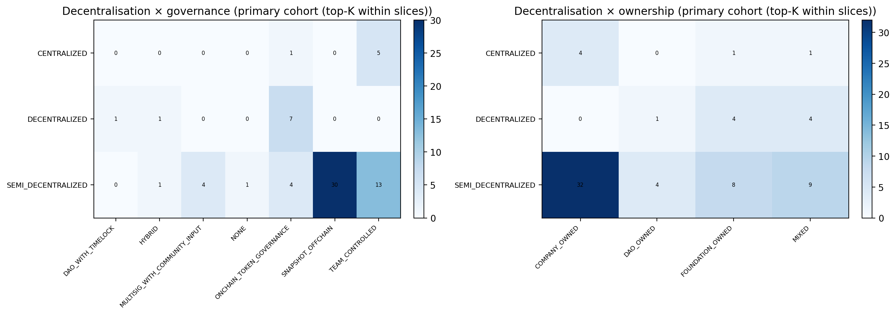

*Figure 4.13: Governance × ownership heatmap — sector × category cohort*

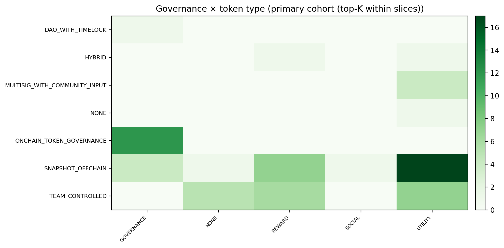

*Figure 4.14: Governance × token type heatmap — sector × category cohort*

*Figure 4.15: Governance label distribution — sector × category cohort*

The sector–governance co-structure confirmed by the cohort figures is consistent with the governance–performance correlation in §4.3.4: DeFi DApps exhibit the highest median governance scores and on-chain governance prevalence; gaming DApps cluster in the lower governance-score quadrants with predominantly team-controlled structures. This reinforces the thesis's central argument that sector and governance are systematically co-determined rather than independent dimensions.

---

## 4.9 Anomalies, Contradictions, and Challenges to the DApp Narrative

The preceding sections characterise the DApp landscape through systematic cross-sectional lenses. This section catalogues four categories of structural anomaly that emerge from the dataset and resist easy explanation within the dominant framings of DApp governance and market efficiency. Each anomaly is quantified, illustrated with representative examples, and cross-referenced to the interpretive discussion in Chapter 5. Together, they constitute an empirical challenge to four simplifying narratives — that governance tokens enable community control, that venture capital predicts market success, that user scale signals economic value, and that TVL is a reliable proxy for protocol importance — that pervade how the DApp ecosystem is publicly assessed.

---

### 4.9.1 Governance Tokens Without Governance Authority

The first anomaly concerns the co-occurrence of governance token issuance with team-controlled governance processes. The dataset identifies DApps that hold a token classified as a governance asset while the operational governance structure is team-controlled (ANO-GOV-01). Two DApps in the strict eligible set meet this strict definition — both hold governance-type tokens yet retain all material decision-making authority within a founding team or core contributor group, without evidence of binding on-chain or off-chain community votes.

The pattern becomes more pronounced under a broader definitional lens. In the strict sample (N=68), four DApps operating Snapshot off-chain governance hold governance tokens (§4.7), a configuration in which token holders can register preferences but execution authority rests with a team-operated multisig or founding committee rather than with an autonomous on-chain process. Beyond those, one DApp in the CENTRALIZED decentralisation tier holds on-chain token governance as its stated mechanism while remaining operationally centralised (ANO-GOV-03; prevalence: 1.47 per cent of the strict sample) — a configuration typically attributable to upgradeability keys, time-limited multisig overrides, or governance proposals authored and passed by team-controlled wallets without meaningful external participation.

These cases represent a structural decoupling of token design from governance authority. The presence of a governance token does not transfer decision-making power to token holders if proposal thresholds, voting quorums, or execution keys remain team-controlled. In such configurations, the governance token functions primarily as a capital formation instrument — attracting investment and conferring nominal legitimacy — rather than as an effective community governance mechanism. Star Atlas illustrates the ambiguity: its POLIS ve-model and claimed on-chain execution signal formal governance architecture, yet research annotations document team-led execution of game-economy decisions and a retained foundation coordination role. The broader eligible population of 834 DApps would likely surface a materially larger cohort under a permissive screen that included Snapshot-governed DApps with concentrated team token holdings.

The thesis takes a direct interpretive position on this pattern: governance token issuance in the current DApp market phase functions primarily as a capital formation and community signalling mechanism, not as an instrument of genuine governance transfer. Protocols issue governance tokens to access liquidity, attract community attention, and position the protocol within regulatory grey zones while retaining operational authority through multisig thresholds, upgrade keys, or concentrated token distributions that make binding community governance implausible. The dataset's evidence is circumstantial but internally consistent — the DApps classified as governance-token-holding yet team-controlled are concentrated in younger, higher-growth segments of the ecosystem where organisational flexibility is commercially valued over governance credibility. The practical implication for users and investors is that governance token ownership is not a proxy for governance rights: independent verification of proposal participation rates and execution authority is required before any governance claim can be credited.

This anomaly is examined interpretively in §5.3 (Labelling Versus Mechanics, DIS-02), where the gap between governance token design and governance authority is situated within the broader decentralisation paradox and its implications for regulatory framing are assessed.

---

### 4.9.2 Unfunded DApps Outperforming Venture-Backed Peers

The second anomaly challenges the assumption that venture capital backing predicts long-term market performance. Among the strict eligible sample (N=68), 13 DApps raised documented venture capital. The median funding-to-valuation ratio for those protocols — calculated as current market capitalisation divided by total capital raised — is 0.11×, meaning the median funded DApp in the strict sample is valued at approximately one-tenth of the aggregate investment made in it. At the same time, 29.4 per cent of the strict sample's unfunded DApps — approximately 20 protocols (ANO-MKT-03) — achieve market capitalisations that exceed the median funded DApp in the same universe. The 13 funded DApps in the strict sample include KGeN, 1inch Network, Pendle, DLN, Across, Moonwell, SynFutures, ZeroLend, Maple, KernelDAO, Mento, and GoodDollar; two of the 13 (Mento and GoodDollar) report zero market capitalisation at the time of data capture, which is included in the median calculation per the study's method.

Raises data is sparsely documented in the broader dataset: only 38 of the full 855-DApp population (4.4 per cent) have verified fundraising records in the DeFiLlama raises database, so the full-dataset analysis is bounded to this verified subset rather than the entire ecosystem. Within those 38 documented cases, $14.3 billion in capital was raised; the pattern is directionally consistent with the strict-sample finding — no systematic positive relationship between capital raised and current market capitalisation is evident. The directional relationship for funded DApps in the strict sample is negative — higher-funded projects are not systematically associated with proportionately higher market valuations at the time of data capture.

This pattern is consistent across the loose universe, where the broad unfunded-outperformance dynamic holds even as the composition of the funded and unfunded cohorts changes. Several mechanisms are candidates: (1) selection timing, whereby VC capital entered the ecosystem during elevated speculative periods, compressing subsequent return multiples as prices reverted; (2) the structural open-source dynamics of DApps, which reduce the competitive moats that make institutional backing valuable in traditional startups — if any developer can fork the protocol, the technical exclusivity that justifies a high entry valuation erodes quickly; and (3) community-driven distribution paths that deliver user acquisition independently of the venture networks that typically provide distribution advantages in enterprise software.

The anomaly does not imply that capital is without value in DApp development. Security audits, engineering hiring, and regulatory navigation all benefit from liquidity. What the data challenge is the stronger claim that capital raised serves as a reliable predictor of long-term market performance. This finding is developed interpretively in §5.7 (Funding Efficiency, DIS-06), where three competing causal mechanisms are assessed and the implications for DApp builders are considered.

---

### 4.9.3 High-User DApps with Zero Measurable TVL

The third anomaly concerns the decoupling of user scale from economic substance, as measured by Total Value Locked. Thirty-three DApps in the eligible population of 834 are identified as protocols with above-threshold active user counts combined with centralised governance classifications (ANO-ENG-02). The most active DApp in this group — Pump.fun (7.1 million users, $207 million TVL) — carries substantial locked value and is not part of the zero-TVL pattern; the zero-TVL finding is concentrated among the gaming, gambling, and social protocols that constitute the remaining 32 flagged DApps. One additional exception within the group is attributable to a data-coverage gap: Stargate (cross-chain bridge, approximately 169,000 users) shows TVL = $0 in the dataset due to a discrepancy between DappRadar's coverage and DeFiLlama's bridge-liquidity methodology; Stargate's documented TVL on DeFiLlama is approximately $112 million. Excluding Pump.fun and the Stargate data gap, the zero-TVL pattern holds for the remaining 31 flagged DApps — a group in which high user counts co-exist with effectively zero on-chain capital, directly contradicting the implicit model in which user scale predicts capital deployment.

Representative cases drawn from the strict and adjacent samples — distinct from the 33-DApp flag group — further illustrate the structural TVL-decoupling pattern across non-DeFi protocol types:

- **Hot Spring — The Cozy World** (2,924,351 active users; TVL: not applicable — AI gaming protocol with no DeFi locking mechanism; volume: $0): an AI-native gaming application operating under HYBRID governance. User activity generates token distributions rather than on-chain liquidity; the protocol's economic throughput is not captured by DeFiLlama's TVL methodology.
- **Alaya AI** (1,869,774 active users; TVL: $0 — confirmed via DeFiLlama; volume: $0): a data-labelling protocol using reward tokens for task completion. Listed on DeFiLlama with confirmed TVL = $0. Economic value is generated off-chain through data sales and captured by the protocol operator, with no on-chain TVL.
- **Dmail Network** (2,088,315 active users; volume: $13,700; TVL: not applicable — messaging protocol with no DeFi locking mechanism): a decentralised messaging protocol under TEAM_CONTROLLED governance, with near-zero financial throughput despite a user base larger than many established DeFi protocols.
- **FishWar** (560,738 active users; market cap: $0.3M; TVL: not applicable — gaming protocol with no DeFi locking mechanism): a gaming protocol distributing reward tokens under team-controlled governance with claimed governance voting but no evidence of binding DAO execution.

Across the DePIN sector (N=29, loose universe), 4.9 million collective active users generate only $8.6 million in total volume — an average of $1.74 per user — and negligible TVL. Within the AI sector (N=67, loose universe), the four most-used DApps by wallet count (Hot Spring, Alaya AI, OpenPad AI, and Sleepless AI) report combined volume of approximately zero (ANO-AI-01, §4.6.3). Neither pattern represents operational failure within the reward-economy models of these protocols; both are structurally expected given business models that distribute token rewards rather than intermediate financial transactions.

What makes the pattern anomalous is the category error it introduces when these protocols are evaluated against DeFi-calibrated metrics. A protocol with two million active users and zero TVL cannot be meaningfully ranked against a DeFi protocol with 50,000 users and $5 billion TVL using a composite metric that aggregates both dimensions. The two measurements index different economic logics, and their aggregation produces a distorted picture of relative importance in the DApp ecosystem. This methodological implication is developed in §5.5 (The Engagement Gap, DIS-04) and acknowledged explicitly in the limitations framework of §5.10.

---

### 4.9.4 Extreme TVL Leverage Cases

The fourth anomaly concerns protocols in which TVL substantially exceeds the token market capitalisation — what this study terms the TVL leverage phenomenon. In the strict sample (N=68), 8.82 per cent of DApps (six protocols, ANO-MKT-02) exhibit TVL that materially exceeds their token market capitalisation. The most pronounced cases are:

- **Morpho** (TVL approximately $187.5 billion; MCap materially lower; implied TVL/MCap approximately 3,437×): a modular DeFi lending protocol serving as infrastructure for other protocols' liquidity. TVL accumulates through recursive collateral loops where depositors use Morpho positions as collateral in secondary markets; the aggregate locked value therefore includes collateral committed by protocols building on Morpho, not only by end-users directly.
- **EigenLayer** (large TVL from restaked ETH; MCap substantially lower): a restaking protocol in which ETH holders commit already-staked assets to additional security commitments, effectively enrolling existing security collateral in an additional system. DeFiLlama's TVL methodology counts the committed ETH as locked, producing TVL that substantially exceeds the protocol's token market capitalisation.
- **LIDO** (TVL from staked ETH; MCap representing governance and fee rights over a fraction of staking yield): the dominant liquid staking protocol, where user deposits generate TVL through the staking mechanism while LDO token holders retain governance and fee-accrual rights proportional to the protocol's yield margin rather than the full deposited value.
- **Ethena** (TVL: $14.2 billion; MCap: $1.8 billion; TVL/MCap ≈ 7.8×): a synthetic dollar protocol whose sUSDe deposits are backed by staked ETH and short perpetual futures positions. TVL represents depositor liabilities that Ethena services, not protocol equity; the ENA token captures governance and a share of the basis-trade yield, not ownership of the deposited collateral.
- **KernelDAO** and **Pendle** exhibit moderate TVL/MCap inversions consistent with infrastructure and yield-market roles where fee capture is calibrated on a small fraction of managed value.

Three distinct structural mechanisms produce the TVL leverage phenomenon. The first is *recursive collateral looping*: infrastructure-layer protocols accumulate TVL through other protocols' use of their facilities, not through direct deposits by retail or institutional end-users. The second is *staking and restaking economics*: liquid staking and restaking protocols capture committed ETH as TVL under DeFiLlama's methodology, producing figures that reflect security commitments rather than traditional financial lock-up. The third is *liability-side TVL*: in synthetic asset protocols, TVL represents user deposits backing a synthetic liability rather than protocol equity; the protocol's equity interest is the fee on the spread between yield components, not ownership of the deposited collateral.

The analytical consequence is that TVL, like user count, is not a single-dimensional measure of economic weight. A protocol with TVL of $187 billion and MCap of tens of millions is not necessarily undervalued; it may instead reflect a business model in which the protocol captures a small fee percentage on managed value, and market capitalisation prices the present value of those fees rather than the face value of managed assets. Practitioners and researchers who use TVL as an unmodified proxy for protocol importance will systematically overstate the economic significance of infrastructure protocols relative to application-layer protocols where TVL/MCap ratios are more moderate.

Note also the related but directionally inverse case documented in §4.6.4 (ANO-RWA-02): Maple's 30-day volume ($34.3 billion) exceeds its TVL ($2.6 billion) by approximately 13.1×, indicating capital velocity — the repeated recycling of institutional capital through short-tenor lending cycles — rather than the passive accumulation that TVL is conventionally taken to represent. TVL leverage and TVL velocity are therefore twin distortions, pulling in opposite directions relative to the naive interpretation of the TVL metric.

This anomaly reinforces the broader argument developed in §5.4 (Concentration Mirrors Traditional Technology, DIS-03) that headline metrics in the DApp ecosystem require sector-aware and model-aware interpretation.

---

### 4.9.5 Synthesis: Challenges to the DApp Narrative

The four anomalies documented in this section share a common structure: each exposes a divergence between a metric that the DApp ecosystem's dominant narrative treats as a reliable signal and the underlying economic or governance reality that metric purports to index.

**Table 4.19 — Summary of anomaly categories, prevalence, and cross-references**

| Anomaly category | Identifier | N DApps affected | Cross-reference |
|------------------|-------------------|:----------------:|:----------------|
| Governance token with team-controlled governance | ANO-GOV-01 | 2 (strict definition); broader under inclusive screen | §5.3 DIS-02 |
| Unfunded DApps outperforming funded peers | ANO-MKT-03 | ~20 (29.4% of strict sample, N=68) | §5.7 DIS-06 |
| High-user / zero TVL | ANO-ENG-02 | 33 (loose eligible, N=834) | §5.5 DIS-04 |
| Extreme TVL leverage (TVL >> MCap) | ANO-MKT-02 | 6 (8.82% of strict sample, N=68) | §5.4 DIS-03 |

*DApp counts refer to the strict sample (N=68) unless otherwise noted.*

Together, these anomalies constitute an empirical case for methodological caution in DApp research and practice. No single metric — governance label, token type, funding status, user count, or TVL — should be treated as a stand-alone indicator of DApp quality, governance authenticity, or economic significance. The interpretive weight given to any metric depends on the sector, business model, and revenue architecture of the DApp in question. This observation motivates the multi-dimensional evaluation framework proposed in §5.9 (Implications for Theory and Practice) and underpins the limitations discussed in §5.10.

---

## 4.10 Cross-Sectional Summary

The results presented in this chapter address the thesis's three research questions: (RQ1) the current governance and ownership structure of the DApp ecosystem; (RQ2) the alignment between governance labels and observed economic structure; and (RQ3) sector-level differences characterising the ecosystem. The findings are summarised below.

**RQ1 — Governance structure.** The DApp ecosystem is predominantly centrally governed at the application layer. In the strict high-signal sample (N=68), 86.8 per cent of DApps are not fully decentralised; 52.9 per cent are company-owned and 26.5 per cent are team-controlled. Governance token issuance (25–26 per cent of the strict sample) is concentrated in on-chain governance regimes but also appears in off-chain and hybrid contexts, indicating partial decoupling of token design from governance authority. These findings respond directly to RQ1 by establishing that the application-layer governance reality diverges substantially from the blockchain infrastructure's decentralisation properties.

**RQ2 — Governance alignment and economic concentration.** The strict universe simultaneously exhibits better governance quality and higher market concentration than the loose universe — a combination that directly addresses RQ2. The top-10 market cap share is 80.5 per cent in the strict sample versus 57.5 per cent in the loose universe, while the multi-chain deployment rate doubles. The 1.3× market cap premium for multi-chain DApps (full dataset, N=855), the positive governance–performance correlation (r=0.38), and the unfunded-outperformance anomaly (29.4 per cent of strict DApps) all suggest that structural features of the ecosystem — governance, chain strategy, capital structure — correlate with market outcomes in non-trivial ways. However, the cross-sectional design cannot establish causal direction.

**RQ3 — Sector-level differentiation.** The DeFi–gaming divide is large enough to render ecosystem-wide averages analytically misleading. DeFi DApps dominate the strict sample in volume ($299.1 billion), market capitalisation, and governance quality; gaming DApps dominate in user count (12.7 million active wallets in the strict sample) but generate orders-of-magnitude less financial throughput per user. Any evaluation of DApp performance or ecosystem health must account for this sectoral heterogeneity — a point that motivates the sector-disaggregated analysis throughout Chapter 5.

Across these findings, the thesis advances three directional claims that challenge prevailing assumptions about the DApp ecosystem. First, application-layer decentralisation is rare and structurally different from infrastructure-layer permissionlessness — the two are not equivalent, and team-controlled governance at scale is the modal outcome, not an exception. Second, conventional financial signals imported from startup and public-market frameworks — venture capital raised, headline user count, TVL — are systematically misleading when applied across the DApp sector without disaggregation by business model and economic architecture; the median funded DApp in the strict sample carries a 0.11× funding-to-valuation ratio, while protocols reporting zero TVL include some of the ecosystem's most-used applications by wallet count. Third, the protocols that have achieved both scale and governance quality are disproportionately those operating in DeFi markets with competitive pressure to establish credible neutrality — suggesting that market structure, not ideological commitment to decentralisation, is the primary driver of governance formalisation. The discussion chapter develops these claims interpretively and assesses their implications for researchers, investors, and policymakers engaged with the DApp ecosystem.
