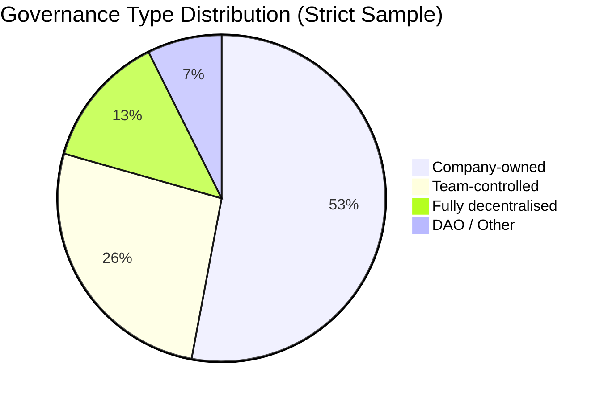
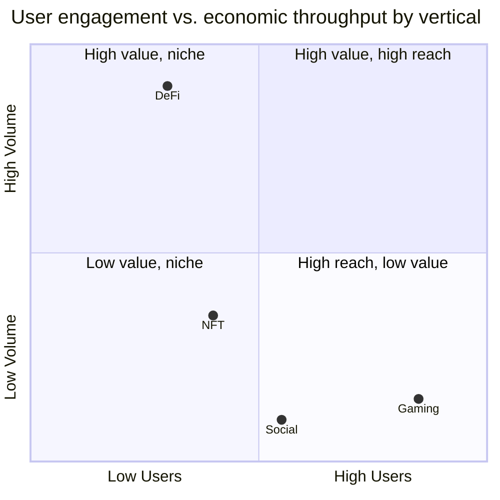
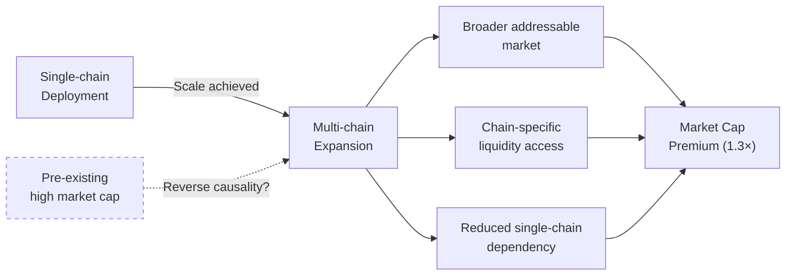

# Chapter 5: Discussion

## 5.1 Overview

The results in Chapter 4 reveal structural tensions that resist easy resolution. This chapter interprets those findings in light of Web3 and blockchain governance literature, examining seven interlocking paradoxes that emerge from the strict-eligible sample of 68 high-signal DApps. The discussion proceeds from governance structure to market concentration, from engagement asymmetry to capital efficiency, and concludes with the implications for theory and practice.

The overarching argument: the blockchain layer is technically decentralised, but the application layer built on top of it is not. This disjunction reflects deliberate design choices, commercial incentives, and practical constraints of early-stage development — not incidental outcomes.

---

## 5.2 The Decentralisation Paradox (DIS-01)

The most arresting finding is the gap between Web3's infrastructure promise and the governance reality of DApps built on that infrastructure. As reported in §4.2, only a small minority of strict-eligible DApps carry a fully decentralised label; the majority are company-owned or team-controlled.

**Figure 5.1 — Governance type distribution (strict sample, N = 68)**

This is the decentralisation paradox at scale: the majority of high-signal DApps are *not* fully decentralised, despite being deployed on permissionless blockchains. The Ethereum Virtual Machine, Solana's runtime, or BNB Chain's validator network may be technically decentralised, yet the contracts they execute and the interfaces users interact with remain under concentrated control.

Three explanations are available. The first is developmental: nascent projects rationally retain control while iterating toward product–market fit, intending to transfer governance once the protocol matures. This "progressive decentralisation" pathway is explicitly articulated by practitioners (Dixon, 2021) and is not inherently dishonest.

The second is commercial: governance retention allows founding teams to respond quickly to exploits, pivot product direction, and negotiate regulatory compliance — advantages pure on-chain governance cannot easily replicate.

The third is less charitable: the decentralisation label functions as a marketing asset rather than a governance commitment. The co-occurrence patterns in DIS-02 below lend support to this interpretation.

What the data establish is that the Web3 ecosystem, measured at the application layer, is structurally far more centralised than its public narrative acknowledges.

---

## 5.3 Labelling Versus Mechanics (DIS-02)

The decentralisation paradox is sharpened by a second observation: governance labels and governance mechanics frequently diverge. Two patterns stand out.

First, some DApps issue governance tokens while the operational process remains team-controlled. The token design signals democratic intent, but the actual decision flow runs through a founding team or small committee. Token concentration, high quorum requirements, and team veto powers render formal voting rights effectively inactive.

Second, certain DApps are labelled "decentralised" in their marketing while a company entity retains smart contract ownership — and can therefore upgrade contracts, pause the protocol, or redirect funds.

These patterns suggest that token design, in a significant share of cases, serves capital formation more than community empowerment. Initial token offerings attract capital; the governance framing justifies the token's existence within regulatory grey zones. Once capital is secured and the protocol gains traction, the incentive to transfer genuine governance authority weakens.

The analytical implication: governance labels alone are an unreliable proxy for governance reality. Future research and regulatory frameworks should focus on governance mechanics — upgrade key holders, multisig composition, timelock durations, token distribution among non-team addresses.

---

## 5.4 Concentration Mirrors Traditional Technology (DIS-03)

One of blockchain's foundational claims is that permissionless infrastructure prevents the monopolistic concentration defining Web2 platforms. The results challenge this claim.

As reported in §4.3, the top ten DApps account for the vast majority of both market capitalisation and active wallets — concentration ratios broadly comparable to, and in the user dimension more severe than, those observed in traditional platform markets. The power law distribution estimated across the full dataset is consistent with winner-takes-most dynamics in social media and digital marketplaces (Clauset, Shalizi, and Newman, 2009).

**Figure 5.2 — Market cap and user base concentration (strict sample)**

```mermaid
xychart-beta horizontal
    title "Share held by top 10 DApps vs. rest (strict sample)"
    x-axis ["Market Cap", "Active Users"]
    bar [80.5, 90.1]
    bar [19.5, 9.9]
```

*Top 10 share (dark); remaining 58 DApps (light). Source: §4.3.*

Permissionless infrastructure relocates, rather than flattens, winner-takes-most dynamics. Network effects are as powerful in DeFi liquidity pools as in social networks: a DEX with deeper liquidity attracts more traders, which deepens liquidity further. Trust amplifies this further — in an environment of smart contract exploits and rug pulls, users concentrate on protocols with established track records and high TVL, since size functions as a credibility signal.

Concentration measurement is further distorted by the TVL leverage phenomenon (§4.9.4, ANO-MKT-02): six strict-sample protocols exhibit TVL that materially exceeds token market capitalisation, driven by recursive collateral looping, staking economics, and liability-side TVL. These protocols are not undervalued — their capitalisation prices fee income, not managed assets. The inverse case, Maple's capital velocity (ANO-RWA-02), confirms that TVL leverage and TVL velocity are twin distortions requiring sector-aware interpretation: observed concentration ratios overstate infrastructure-protocol dominance when TVL is used as an unmodified proxy for economic weight.

The implication: decentralised infrastructure is necessary but not sufficient for a decentralised application economy. Without active intervention — through protocol design, regulatory constraint, or shifts in user behaviour — the DApp economy reproduces the concentration patterns of the industries it set out to disrupt.

---

## 5.5 The Engagement Gap (DIS-04)

As detailed in §4.5, gaming DApps attract large user populations while generating modest financial throughput, whereas DeFi DApps process enormous transaction volume with smaller user bases. The value-per-user gap between these two verticals exceeds three orders of magnitude.

**Figure 5.3 — Engagement vs. economic value by vertical (conceptual)**

This disparity exposes the inadequacy of user count as a universal success metric. In gaming, active wallets often represent players engaged in play-to-earn mechanics with modest monetary value — a user earning fractional dollars per session. In DeFi, a single wallet might represent an institutional participant cycling tens of millions through liquidity positions.

A defensible measurement framework would differentiate between engagement volume (wallet count), economic throughput (volume, TVL), and capital efficiency (volume per user, TVL per user). A DApp optimised for user count targets a fundamentally different objective than one optimised for capital deployment — conflating them produces misleading league tables and misallocated analytical attention.

---

## 5.6 Governance Realism Under Concentration (DIS-05)

Token-based governance is presented as a mechanism for aligning diverse stakeholders in decentralised protocols. In practice, the market concentration documented in §4.3 interacts with token distribution to produce outcomes resembling plutocracy more than democracy.

If the top DApps hold the vast majority of ecosystem value, and if governance token distribution within those projects is similarly concentrated — as the literature consistently suggests (Fritsch, Fritsch, and Wattenhofer, 2022) — then effective voting control rests with a small number of large holders: founding teams, early investors, protocol treasuries, and a handful of large funds. Retail token holders, though formally enfranchised, face a coordination problem that renders their participation practically irrelevant on contested votes.

On-chain voting records of major DeFi governance systems support this picture. Proposals frequently pass with participation below five per cent of eligible tokens, with decisive votes concentrated in three to five wallets (Barbereau et al., 2022). The governance mechanism is real; the democratic property it purports to deliver is largely fictive.

A realistic governance model for current concentration realities would acknowledge large-holder dominance on contentious votes, design delegation mechanisms enabling liquid democracy, and invest in coordination infrastructure — forums, working groups, temperature checks — giving non-dominant holders meaningful input before formal votes.

---

## 5.7 Funding Efficiency (DIS-06)

Venture capital has been a defining feature of the Web3 ecosystem since at least 2017. The results challenge its efficacy.

As reported in §4.9.2, only a small subset of strict-eligible DApps raised documented venture capital, and their median funding-to-valuation ratio is well below 1×. A substantial share of unfunded DApps exceed the market capitalisation of their venture-backed peers.

Three interpretations are available. First, VC participation may be a lagging indicator of hype cycles: funding rounds in Web3 frequently follow token price appreciation rather than precede it, and the multiple is compressed as prices revert. Second, the operational characteristics of a successful DApp — open source codebase, permissionless access, community distribution — are less amenable to the value-appropriation mechanisms that make VC backing valuable in traditional startups. Third, funds may systematically favour compelling founders and high-profile ecosystems over genuine product–market fit, while the market independently identifies real utility.

The implication: raising venture capital should not be treated as a prerequisite for success or confused with product validation. Capital is useful for hiring, security audits, and market access, but the data do not support the hypothesis that it reliably predicts long-term market performance.

---

## 5.8 Multi-Chain Strategy: Correlation or Causation? (DIS-07)

As reported in §4.4, a substantial majority of strict-eligible DApps deploy on multiple blockchains, and multi-chain DApps command a meaningful median market capitalisation premium over single-chain peers.

**Figure 5.4 — Multi-chain deployment and performance pathway**

The causal interpretation is unclear. Multi-chain deployment may *cause* superior performance through expanded addressable market and chain-specific liquidity. Alternatively, it may be an *effect* of prior success: deploying across chains requires security audits, bridge infrastructure, and ongoing maintenance overhead that only well-capitalised protocols can absorb. The observed premium may therefore reflect survivorship bias rather than a genuine value driver.

The data cannot discriminate between these mechanisms. Practitioners should treat the multi-chain premium as a plausible growth lever while remaining alert to reverse-causality explanations. Longitudinal data tracking deployment timing relative to valuation milestones would be required to establish directionality.

For small, single-chain teams, the pragmatic implication is clear: a well-executed single-chain product likely provides a better foundation for eventual multi-chain expansion than a prematurely distributed architecture that strains limited engineering capacity.

---

## 5.9 Implications for Theory and Practice

### 5.9.1 Blockchain Governance Literature

This study contributes to empirical work challenging the conceptual frameworks inherited from cypherpunk philosophy, in which decentralisation is treated as both technically inevitable and normatively desirable. Neither property holds at the application layer.

Decentralisation is not technically inevitable: the same permissionless infrastructure that enables censorship-resistant computation also enables centralised applications, and developers systematically choose the latter in commercially sensitive contexts. Governance scholars should shift their unit of analysis from the protocol layer — where decentralisation is structurally enforced — to the application layer, where it is a design choice.

The normative question is equally complicated. Users concentrate on centralised DApps and high-volume, low-decentralisation protocols without apparent regard for governance structure (see §4.2, §4.5). If demand does not reward decentralisation, the governance literature must account for why it should be pursued as a design goal beyond its regulatory positioning value.

The concentration findings align with network economics scholarship on platform markets (Rochet and Tirole, 2003; Parker, Van Alstyne, and Choudary, 2016) and suggest the DApp economy is better understood through the lens of two-sided markets than open-source software ecosystems. Liquidity, users, and developer attention exhibit the same tipping dynamics in DApp markets as in search, social media, and e-commerce.

### 5.9.2 Practical Implications for DApp Builders

Five actionable observations emerge.

First, success cannot be measured by a single metric. User count, volume, TVL, market cap, and governance score capture different dimensions that trade off depending on vertical. Builders should define metrics appropriate to their economic model before seeking external validation.

Second, governance design should precede token issuance. Retaining team control long after token distribution creates a credibility deficit that is difficult to recover. Projects intending to transfer governance should design the transfer pathway into the protocol from the outset.

Third, capital efficiency matters more than capital raised. Unfunded DApps regularly outperform VC-backed peers. Builders should be sceptical of the narrative that a funding round constitutes validation or guarantees competitive advantage.

Fourth, multi-chain expansion should be sequenced, not simultaneous. Given the cost structure of multi-chain deployment and the evidence that the premium may reflect selection rather than causation, early-stage teams should achieve protocol stability on a primary chain before incurring additional overhead.

Fifth, on-chain governance is a long-term project, not a launch feature. Meaningful governance requires sustained investment in coordination infrastructure — grants, forums, working groups, delegation tooling — that most early-stage projects are not equipped to maintain. Treating governance as an operational commitment rather than a marketing claim would improve the credibility of the Web3 ecosystem overall.

---

## 5.10 Limitations

This study is subject to several limitations that constrain generalisability.

**Snapshot timing.** The dataset reflects a single cross-sectional export from November 2025. Market capitalisation, TVL, user counts, and governance scores are volatile and can shift substantially over weeks. Findings should be understood as characterising the ecosystem at one point in time. Longitudinal replication would be required to establish durability.

**Survivorship bias.** The strict eligibility criteria systematically exclude failed projects and early-stage DApps that never achieved measurable traction. The 68-DApp strict sample represents the observable, successful tail of a larger population. Concentration ratios and funding-to-valuation figures are calculated over a sample that has already survived a stringent selection process; the true ecosystem state is likely more concentrated and less capital-efficient.

**Raises data coverage.** As noted in §4.9.2, documented fundraising records cover only a small fraction of the full dataset; the remainder appear unfunded whether they genuinely raised nothing or simply did not publicise rounds. Caution is warranted when generalising the unfunded-outperformance finding beyond the documented sample.

**Manual coding subjectivity.** Governance labels and token type classifications were assigned through automated heuristics and manual review. These categories are not crisply defined in the industry, and the same DApp might be coded differently by two analysts. Sensitivity analysis on coding decisions was not conducted; future work should apply inter-rater reliability testing.

**Data source coverage.** The dataset integrates DappRadar, CoinGecko, and DeFiLlama, each with its own eligibility and measurement conventions. Protocols not indexed by these platforms — particularly those on newer or less-covered chains — are absent from the analysis.

**Reverse causality.** Several findings involve relationships where causal direction is ambiguous — most clearly the multi-chain deployment premium, but also the governance-score/market-cap correlation reported in §4.3.4. These associations are descriptive; causal inference would require instrumental variable approaches beyond the scope of this cross-sectional study.

---

## 5.11 Summary

The discussion has traced seven structural tensions through blockchain governance theory, market economics, and practitioner reality. The decentralisation paradox, the divergence of governance labels from governance mechanics, the reproduction of traditional tech concentration, the orders-of-magnitude engagement gap between verticals, the limits of on-chain democracy under concentrated token ownership, the failure of venture capital as a reliable performance predictor, and the ambiguous causal status of the multi-chain premium — each challenges a widely held assumption about how DApp markets work.

Taken together, they suggest the DApp ecosystem is best understood not as a technological disruption of traditional market structures but as a reconfiguration of those structures under new institutional rules. Permissionless infrastructure lowers entry barriers without flattening winner-takes-most dynamics. Governance tokens distribute formal rights without redistributing effective power. Decentralisation is more frequently a design aspiration or regulatory posture than an operational reality.

None of this denies that Web3 has distinctive innovations. Verifiable, composable, and non-custodial financial infrastructure is genuinely novel. But the application layer, as measured in this study, has not yet made good on its most ambitious governance and distribution claims. Whether it does so in future iterations is an empirical question that longitudinal research is better positioned to answer.
