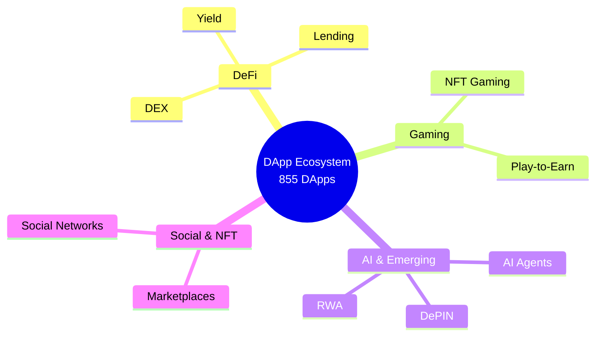
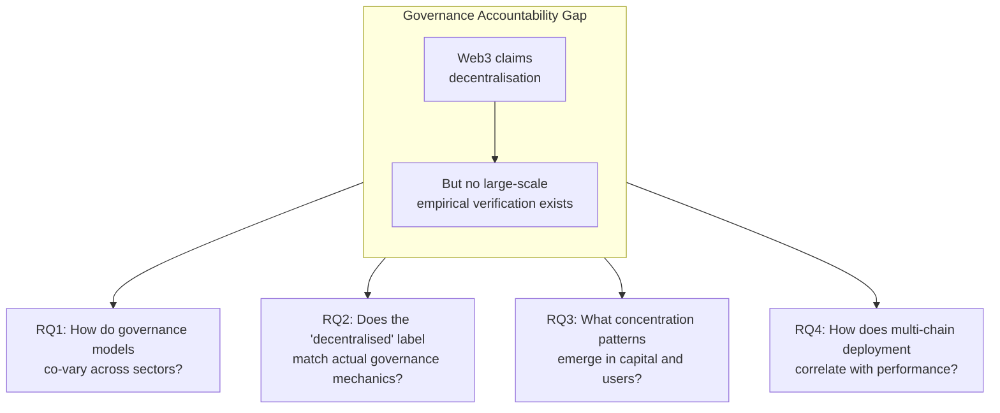
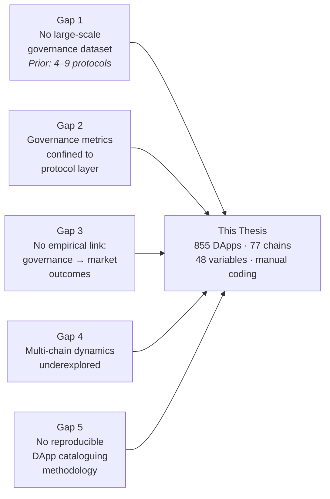
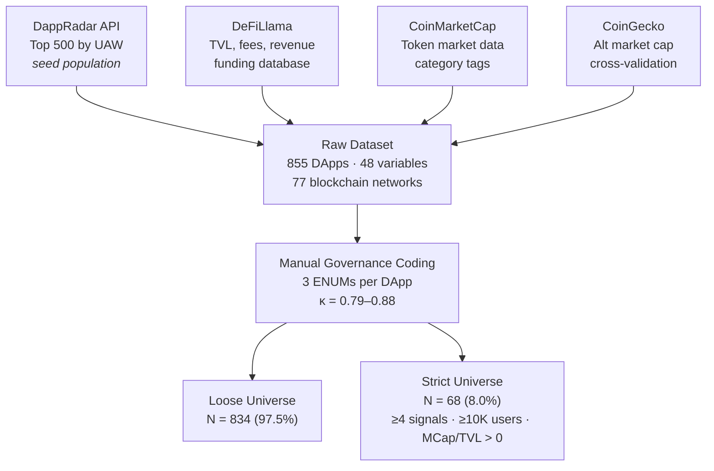
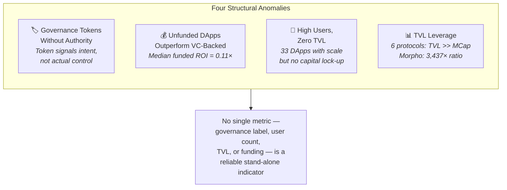
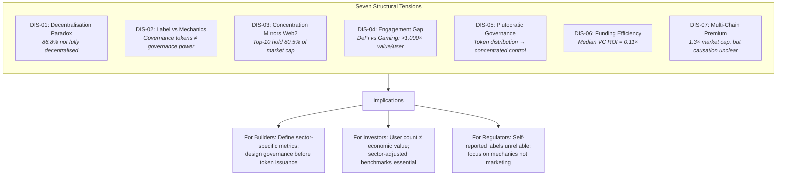

```mermaid
flowchart LR
    subgraph F["Five Headline Findings"]
        direction TB
        F1["86.8% not fully<br/>decentralised"]
        F2["Top-10 hold 80.5%<br/>of market value"]
        F3["DeFi–Gaming gap<br/>exceeds 1,000×"]
        F4["Multi-chain DApps<br/>show 1.3× premium"]
        F5["Median funded<br/>ROI = 0.11×"]
    end
    subgraph L["Limitations"]
        direction TB
        L1["Cross-sectional<br/>snapshot (Nov 2025)"]
        L2["Survivorship bias<br/>in strict sample"]
        L3["Causal direction<br/>ambiguous"]
    end
    subgraph FD["Future Directions"]
        direction TB
        FD1["Longitudinal<br/>governance tracking"]
        FD2["On-chain voting<br/>participation analysis"]
        FD3["Cross-chain<br/>causal studies"]
    end
    F --> L --> FD
```

# Thesis Defense Presentation — v3

**Thesis Title:** Decentralised Applications in Focus: Governance, Market Structure, and Adoption Patterns

**Institution:** Politecnico di Milano — Master of Science, Digital Innovation Observatory, Blockchain

**Duration:** 10 minutes · 11 slides · 5 phases

**Dataset:** 855 DApps · 77 blockchains · 48 variables · November 2025

---

### Slide 1 — Title & Opening

**Slide Title:** "Decentralised Applications in Focus: Governance, Market Structure, and Adoption Patterns"

**Key Visual Elements:**
- Thesis title, author name, institution, date
- Dataset summary badge: 855 DApps · 77 chains · 48 variables · Nov 2025

**Speaking Script (~30 seconds):**

"Good morning. My thesis examines whether the governance and ownership labels in the decentralised application ecosystem correspond to observable economic and adoption realities. The dataset behind this work covers 855 DApps across 77 blockchain networks, with 48 variables per application — including three manually coded governance dimensions. What I want to show you today is that the promise of decentralisation and the reality of how these applications are governed are substantially different."

---

### Slide 2 — What I Did: Research Questions & Motivation

**Slide Title:** "The Governance Accountability Gap: Four Questions That Frame This Thesis"

**Key Visual Elements:**

**Key Takeaways:**

- The DApp ecosystem spans 855+ applications across 77 blockchains — yet the fundamental claim that blockchain redistributes power to users has never been empirically tested at scale
- Retail investors, regulators, and researchers rely on self-reported governance labels with no large-scale benchmark to verify them
- Four research questions frame a systematic inquiry: governance distribution (RQ1), label–reality alignment (RQ2), concentration patterns (RQ3), and multi-chain effects (RQ4)

**Speaking Script (~45 seconds):**

"DApps promise to redistribute control from platform owners to users. By November 2025, this ecosystem had grown to over 855 active applications, with 90 million users and 115 billion dollars in locked value. But decentralisation is simultaneously a technical descriptor and a marketing proposition. The empirical evidence for verifying governance claims at scale simply did not exist. Four research questions guide my work: how are governance models distributed across sectors? Does the decentralised label match reality? What concentration patterns emerge? And does multi-chain deployment correlate with market performance?"

---

### Slide 3 — Literature Review: Five Research Gaps

**Slide Title:** "Five Systematic Gaps the Literature Left Open"

**Key Visual Elements:**

**Key Takeaways:**

- **Gap 1:** No large-scale, cross-category, manually coded governance dataset existed — prior studies examined 4–9 protocols at most (Barbereau et al., 2023; Jensen et al., 2021)
- **Gap 2:** Application-layer governance decentralisation is "severely understudied" — existing metrics only cover the consensus/protocol layer (Ovezik et al., 2025)
- **Gap 3–5:** The empirical link between governance structure and market dynamics was never quantified at ecosystem scale; multi-chain and reproducible methodology gaps remained open

**Speaking Script (~45 seconds):**

"The literature review identified five systematic gaps. First, no large-scale governance dataset spanning multiple sectors existed. The deepest prior studies examined four to nine protocols. Second, decentralisation measurement has been confined to the consensus layer — who validates blocks, not who controls the application. Ovezik and colleagues explicitly call application-layer governance 'severely understudied.' Third, no one had empirically linked governance structure to market outcomes like TVL or market capitalisation. Fourth, multi-chain dynamics were underexplored. And fifth, no reproducible DApp cataloguing methodology existed. This thesis addresses all five."

---

### Slide 4 — How I Did It: Methodology & Data Pipeline

**Slide Title:** "855 DApps, Four Data Sources, and a Manual Governance Coding Layer"

**Key Visual Elements:**

| Universe | N | Primary use |
|:---------|:-:|:------------|
| Full dataset | 855 | Descriptive totals; chain counts |
| Loose universe | 834 | Governance distributions; sensitivity tests |
| **Strict universe** | **68** | **All primary findings; clustering; correlations** |

**Key Takeaways:**

- Multi-source pipeline integrating on-chain activity, TVL, and token market data with manual governance annotations across 855 DApps
- Three governance variables hand-coded per DApp: governance type (7 levels), ownership status (6 levels), decentralisation level (3 tiers) — validated with intra-coder κ = 0.79–0.88
- Dual-universe design: loose (N=834) for broad baseline; strict (N=68) with quality gates for all primary findings

**Speaking Script (~1 minute):**

"The methodology combines four data sources. DappRadar provides the seed population and activity metrics. DeFiLlama supplies total value locked. CoinMarketCap and CoinGecko contribute token market data and cross-validation.

The critical innovation is the manual governance coding layer. For all 855 DApps, I hand-coded three governance variables using explicit decision rules: governance type on a seven-level scale, ownership status with six categories, and overall decentralisation level — centralised, semi-decentralised, or decentralised. Intra-coder reliability ranged from 0.79 to 0.88.

The analysis uses a dual-universe design: a loose sample of 834 DApps for baseline tests, and a strict sample of 68 DApps passing rigorous quality gates. The strict sample is the primary vehicle for all findings."

---

### Slide 5 — Results: 86.8% Are Not Fully Decentralised

**Slide Title:** "The Central Finding: Application-Layer Centralisation Is the Norm"

**Key Visual Elements:**

*Figure: Governance label distribution — strict sample (N=68)*

| Metric | Loose (N=834) | Strict (N=68) |
|:-------|:-------------:|:-------------:|
| Fully decentralised | 4.7% | 13.2% |
| Company-owned | 83.0% | 52.9% |
| Team-controlled | 62.7% | 26.5% |
| Median governance score | 0.067 | 0.283 |

*Figure: Governance × ownership heatmap — strict sample (N=68)*

**Key Takeaways:**

- **Central finding:** only 9 of 68 strict-sample DApps are fully decentralised — **86.8% retain meaningful centralisation** despite operating on permissionless blockchains
- The strict sample shows better governance than the broad population (median score 0.283 vs 0.067) — yet remains predominantly company-owned at 52.9%
- Blockchain infrastructure decentralisation does not automatically produce decentralised governance at the application layer

**Speaking Script (~1 minute 15 seconds):**

"This is the headline finding. Of the 68 DApps that passed the strict quality gate, only nine — 13.2 per cent — qualify as fully decentralised. That means 86.8 per cent retain meaningful centralisation, despite being built on permissionless blockchains.

The strict sample actually shows better governance than the broader population — the median governance score quadruples. But even these well-established protocols remain predominantly company-owned at 53 per cent.

This is what I call the decentralisation paradox: the blockchain infrastructure may be technically decentralised, but the applications built on top of it are not. Three explanations emerge: progressive decentralisation as a deliberate lifecycle strategy, commercial incentives to retain operational agility, and — less charitably — decentralisation functioning as a marketing label rather than a governance commitment."

---

### Slide 6 — Results: Winner-Takes-Most Concentration

**Slide Title:** "Top 10 DApps Control 80% of Market Value — Permissionless Entry Does Not Prevent Concentration"

**Key Visual Elements:**

*Figure: Market capitalisation and user concentration — strict sample (N=68)*

```mermaid
xychart-beta horizontal
    title "Top-10 Share vs Rest (Strict Sample)"
    x-axis ["Market Cap", "Active Users"]
    bar [80.5, 90.1]
    bar [19.5, 9.9]
```

**Key Takeaways:**

- **Top-10 concentration:** 80.5% of market capitalisation and 90.1% of user activity — ratios comparable to or exceeding Web2 platform markets (Parker et al., 2016)
- Power-law exponent α ≈ 0.61 confirms winner-takes-most dynamics; permissionless entry does not flatten concentration at the application layer
- Governance quality and market scale co-occur: Spearman r = 0.38 between governance score and log market cap

**Speaking Script (~1 minute):**

"The market structure reinforces this picture. The top ten DApps control 80.5 per cent of total market capitalisation and over 90 per cent of active wallets. The distribution follows a power law — consistent with the winner-takes-most dynamics documented in social media and e-commerce.

So permissionless infrastructure clearly lowers entry barriers — but it does not flatten concentration. Network effects in DeFi liquidity pools are just as powerful as in social networks: deeper liquidity attracts more traders, which deepens liquidity further.

There is also a meaningful co-occurrence between governance quality and market scale — a Spearman correlation of 0.38. Whether markets reward governance, or successful projects simply invest in governance because they can afford to — that is a causal question this cross-sectional design cannot answer. But the association is there."

---

### Slide 7 — Results: The Sector Divide & Ecosystem Contrasts

**Slide Title:** "DeFi and Gaming Operate in Fundamentally Different Economic Worlds"

**Key Visual Elements:**

*Figure: Sector-level performance metrics — strict sample (N=68)*

*Figure: Decentralisation distribution by sector*

| Metric | DeFi | Gaming | AI DApps | Prediction Markets |
|:-------|:----:|:------:|:--------:|:------------------:|
| Key strength | $299.1B volume | 12.67M users | $1.61B MCap | 95.3% vol share (Polymarket) |
| Governance | 13.3% fully decentralised | Team-controlled | 0% fully decentralised | 71.0% team-controlled |
| Value-per-user gap | >1,000× higher than Gaming | Low per-user throughput | MCap priced on option value | Institutional wagering profile |

**Key Takeaways:**

- **DeFi–Gaming gap:** DeFi processes $299.1B in volume; Gaming attracts 12.67M users — the value-per-user gap exceeds 1,000×, a structural divide reflecting different economic architectures
- **AI DApps:** Zero fully decentralised — off-chain AI inference creates an inherent centralisation vector that current technology cannot resolve
- **Single-metric evaluation is systematically misleading** — user count, volume, and TVL produce incompatible success rankings across sector boundaries

**Speaking Script (~1 minute):**

"When we look at sectors, the averages break down completely. DeFi processes 299 billion dollars in volume. Gaming attracts 12.67 million active wallets — far more users. But the value per user is more than a thousand times higher in DeFi. These are fundamentally different economic architectures.

The AI DApp sector is equally revealing: zero applications are fully decentralised. The structural reason is that AI inference requires off-chain computation — model weights, training data, and endpoints are centralised by necessity. Until decentralised AI inference matures, the sector will remain structurally centralised.

The practical takeaway: there is no single universal success metric in this ecosystem. Sector-specific benchmarks are essential."

---

### Slide 8 — Results: Anomalies & Case Studies

**Slide Title:** "Four Findings That Challenge the DApp Narrative"

**Key Visual Elements:**

*Figure: Governance type × token type heatmap — strict sample*

| Case Study | Governance | Key Insight |
|:-----------|:----------:|:------------|
| **Uniswap** | Fully decentralised | Governance leadership as competitive infrastructure in DeFi |
| **Aave** | On-chain DAO | Institutional trust anchor — governance credibility drives TVL |
| **Polymarket** | Team-controlled, no token | Centralisation as equilibrium architecture in prediction markets |
| **Virtuals Protocol** | On-chain governance, yet Centralised | AI governance paradox — formal apparatus without operational decentralisation |
| **Ethena** | Hybrid | TVL leverage: $14.2B TVL represents depositor liabilities, not equity |

**Key Takeaways:**

- **Governance tokens ≠ governance power:** 25% of the strict sample issued governance tokens, yet several retain team-controlled processes — the token signals intent, not authority
- **VC funding ≠ market success:** Median funded ROI is 0.11× — the median venture-backed DApp is worth one-tenth of invested capital; 29.4% of unfunded DApps outperform funded peers
- **Case studies confirm:** governance architecture is sector-contingent — what works in DeFi (on-chain DAO) would cripple a prediction market (needs speed) or AI platform (needs centralised inference)

**Speaking Script (~1 minute):**

"Four anomalies challenge widely held assumptions. First, governance tokens frequently signal intent rather than actual authority — several DApps issued governance tokens while operational control stays with the team.

Second, venture capital does not reliably predict success. The median funded DApp trades at one-tenth of its invested capital, while nearly 30 per cent of unfunded DApps outperform their funded peers.

The case studies sharpen these findings. Uniswap and Aave show that governance credibility is a competitive asset in DeFi. But Polymarket — the most successful prediction market — is entirely team-controlled, because outcome resolution requires speed that DAO governance cannot provide. And Virtuals Protocol has on-chain governance mechanisms but is classified Centralised because AI inference cannot be placed under on-chain control. Governance architecture is sector-contingent, not universally aspired to."

---

### Slide 9 — Discussion: Seven Paradoxes of the DApp Economy

**Slide Title:** "The DApp Economy Reconfigures Traditional Market Structures — It Does Not Eliminate Them"

**Key Visual Elements:**

**Key Takeaways:**

- The blockchain layer is technically decentralised — **the application layer is not**. This disjunction reflects deliberate design choices, commercial incentives, and practical constraints
- Permissionless infrastructure lowers entry barriers **without flattening winner-takes-most dynamics** — network effects are as powerful in DeFi as in social networks
- For builders: governance design should precede token issuance. For investors: sector-adjusted metrics are essential. For regulators: self-reported decentralisation labels are unreliable

**Speaking Script (~1 minute 15 seconds):**

"The discussion traces seven structural tensions. The decentralisation paradox — blockchain is decentralised, applications are not. The gap between governance labels and mechanics — tokens that signal democracy without transferring power. Concentration that mirrors Web2 — top ten DApps holding 80 per cent of value despite permissionless entry. The engagement gap — DeFi and Gaming are incommensurable by any single metric. Plutocratic governance — token-based voting that concentrates power in large holders. Funding inefficiency — venture capital that fails to predict market success. And the multi-chain premium — real but causally ambiguous.

The overarching argument: the DApp economy reconfigures traditional market structures under new institutional rules. It does not eliminate them. Permissionless infrastructure is necessary but not sufficient for a decentralised application economy."

---

### Slide 10 — Conclusions & Future Research

**Slide Title:** "Decentralisation Is an Aspiration, Not Yet a Reality — The Path Forward Requires Measurement"

**Key Visual Elements:**

**Key Takeaways:**

- **Contribution:** The most comprehensive cross-sectional governance census of the DApp ecosystem — 855 DApps, 77 chains, 48 variables with manual governance coding
- **Core insight:** Application-layer decentralisation is rare and structurally distinct from infrastructure-layer permissionlessness; conventional signals (VC funding, user count, TVL) are systematically misleading without sector disaggregation
- **Next step:** Longitudinal tracking — same DApps over time — to test whether governance matures and whether correlations reflect causation

**Speaking Script (~45 seconds):**

"To conclude. This thesis provides an empirical benchmark at a scale not previously attempted — 855 DApps, 77 blockchains, 48 variables with manual governance coding. Five findings stand out: 86.8 per cent of high-signal DApps are not fully decentralised; the top ten control 80 per cent of market value; the DeFi–Gaming value gap exceeds a thousand times; multi-chain deployment correlates with a 1.3 times premium; and the median venture-backed DApp trades at a tenth of its invested capital.

I am transparent about the boundaries: this is a cross-sectional snapshot, subject to survivorship bias, and cannot establish causation. The most important next step is longitudinal — tracking these DApps over time. What the data do establish is this: the DApp economy reconfigures traditional market structures under new institutional rules. It does not eliminate them."

---

### Slide 11 — Thank You

**Slide Title:** "Thank You — Questions?"

**Key Visual Elements:**
- Thesis title, author, institution
- Contact information
- Dataset summary: 855 DApps · 77 chains · 48 variables
- Key references on screen for committee

**Speaking Script:**

"Thank you."

---

## Presentation Summary

| Phase | Slides | Time | Allocation |
|:------|:------:|:----:|:----------:|
| **Phase 1:** Title & Introduction | 1–2 | ~1 min 15 sec | ~12% |
| **Phase 2:** Literature Review | 3 | ~45 sec | ~8% |
| **Phase 3:** Methodology | 4 | ~1 min | ~10% |
| **Phase 4:** Results & Discussion | 5–9 | ~5 min 15 sec | **~53%** |
| **Phase 5:** Conclusions | 10–11 | ~45 sec | ~8% |
| **Total** | **11 slides** | **~10 min** | **100%** |

### Visual Assets Embedded

| Slide | Figure | Source |
|:-----:|:-------|:-------|
| 5 | `02_governance_distribution_strict.png` | Governance label distribution — strict sample |
| 5 | `02_governance_heatmaps_strict.png` | Governance × ownership heatmap — strict sample |
| 6 | `03_market_dynamics_strict.png` | Market cap and user concentration — strict sample |
| 7 | `05_performance_strict.png` | Sector-level performance metrics — strict sample |
| 7 | `eco_decentralisation_stacked_by_sector.png` | Decentralisation by sector |
| 8 | `02_governance_token_heatmap_strict.png` | Governance type × token type heatmap |

### Additional Mermaid Diagrams Created

| Slide | Diagram | Purpose |
|:-----:|:--------|:--------|
| 1 | Mindmap | DApp ecosystem sector overview |
| 2 | Flowchart | Governance accountability gap → 4 research questions |
| 3 | Flowchart | Five literature gaps → thesis positioning |
| 4 | Flowchart | Data pipeline and sample construction |
| 6 | Bar chart | Top-10 concentration visual |
| 8 | Flowchart | Four structural anomalies synthesis |
| 9 | Flowchart | Seven paradoxes → practical implications |
| 10 | Flowchart | Findings → limitations → future directions |

### Design Notes for Slide Production

- All mermaid diagrams can be rendered directly in presentation tools supporting mermaid (Slidev, reveal.js) or exported as SVG/PNG for PowerPoint/Keynote
- PNG figures from `docs/figures/` are referenced with relative paths for VitePress compatibility
- Speaking scripts target ~130 words/minute conversational delivery
- Each slide header summarises its takeaway — no generic titles
- Citations are parenthetical throughout key takeaways for committee reference
